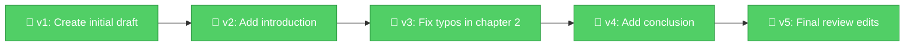

# Chapter 1: Help, My Files Are a Mess! — Why Version Control Exists

[<< Back to Start](00_start_here.md) | [Next: Meet Git >>](02_what_is_git.md)

---

## The Horror Story You Already Know 😱

Picture this. It's 11 PM. You're working on an important document — let's call it `report.doc`. You've been at it for hours. You're almost done. Then you think:

*"I should save a backup before I make this big change..."*

So you do what every reasonable human does:

```
report.doc
report_v2.doc
report_final.doc
report_FINAL.doc
report_FINAL_v2.doc
report_FINAL_FINAL_thisone.doc
report_FINAL_FINAL_thisone_REAL.doc
```

Sound familiar? 😅

Now imagine this chaos, but with a **team of 10 people** all editing the same project. At the same time. Over email. With no idea who changed what.

Welcome to the nightmare that version control was invented to solve.

### Life WITHOUT Version Control

```mermaid
graph LR
    A["📄 report.doc"] --> B["📄 report_v2.doc"]
    B --> C["📄 report_final.doc"]
    C --> D["📄 report_FINAL.doc"]
    D --> E["📄 report_FINAL_v2.doc"]
    E --> F["📄 report_FINAL_FINAL.doc"]
    F --> G["📄 report_REAL_THIS_ONE.doc"]
    G --> H["😭 Which one is the right one?!"]

    style H fill:#ff6b6b,color:#fff,stroke:#ff4444
    style A fill:#ffd93d,stroke:#f5c518
    style B fill:#ffd93d,stroke:#f5c518
    style C fill:#ffd93d,stroke:#f5c518
    style D fill:#ffd93d,stroke:#f5c518
    style E fill:#ffd93d,stroke:#f5c518
    style F fill:#ffd93d,stroke:#f5c518
    style G fill:#ffd93d,stroke:#f5c518
```



Every file looks important. None of them make sense. You open three of them and they all look... the same? Or do they? You can't tell. Panic sets in.

## Now Imagine a Better World 🌈

What if instead of all those copies, you had **one file** — but with a magical timeline attached to it? Every time you saved a meaningful change, it was recorded with:
- **What** changed
- **When** it changed
- **Who** changed it
- **Why** they changed it (a little note from past-you)

And at any point, you could **rewind** to any previous version. Like a time machine for your project.

### Life WITH Version Control



One file. Clean history. You can go back to any version. You can see exactly what changed between any two versions. You can even have multiple people working on the same file and **automatically** combine their changes.

That's version control. That's the dream. ✨

## What Does Version Control Actually Give You?

Let's break it down:

| Without Version Control | With Version Control |
|---|---|
| 🗂️ Dozens of file copies | 📁 One project, full history |
| 🤷 "Who changed this?" | 👤 Every change tagged with author |
| 😰 "Can we go back to Tuesday's version?" | ⏪ Rewind to any point in time |
| 💥 Two people edit = someone's work gets lost | 🤝 Changes merge together automatically |
| 📧 Sharing via email/USB drives | ☁️ Everyone syncs from one source |

## 🎭 Fireside Chat: Manual Copies vs Version Control

> *Manual Copies and Version Control sat down for coffee. It did not go well.*
>
> **Manual Copies:** "I'm simple! Just copy the file and rename it. Anyone can do it!"
>
> **Version Control:** "Sure, and anyone can also set their kitchen on fire trying to cook. Doesn't mean there isn't a better way."
>
> **Manual Copies:** "But I don't need any special tools!"
>
> **Version Control:** "You also don't have any way to see what *actually* changed between copies. Or who changed it. Or why."
>
> **Manual Copies:** "I... I put the date in the filename?"
>
> **Version Control:** "Was that `report_march5` or `report_march5_fixed` or `report_march5_fixed_REAL`?"
>
> **Manual Copies:** *sweats nervously* 😓
>
> **Version Control:** "I track every change, every author, every timestamp, and I can show you the exact difference between any two points in history. I also let your whole team work at the same time without stepping on each other's toes."
>
> **Manual Copies:** "...I'll get my coat."

## The Big Idea 💡

Version control is a system that **records changes to files over time** so you can:

1. **Go back** to any previous version
2. **See what changed** between any two versions
3. **Work with others** without overwriting each other's work
4. **Experiment freely** knowing you can always undo

Think of it as an **unlimited undo button** that works across your entire project, remembers everything forever, and lets multiple people collaborate without chaos.

> **🧠 Brain Power**
>
> Think about a time you lost work — a document, a spreadsheet, some code, anything. How long did it take you to redo it? How did it feel?
>
> Now imagine if you could have just pressed "rewind" and gotten it back in 2 seconds.
>
> That's the problem version control solves. And in the next chapter, you'll meet the most popular version control tool in the world.

---

🏆 **Level 1 Complete!** You now understand WHY version control exists. You know the pain it solves. You've felt that pain. Next up — let's meet the tool that makes it all happen.

---

[<< Back to Start](00_start_here.md) | [Next: Meet Git >>](02_what_is_git.md)
