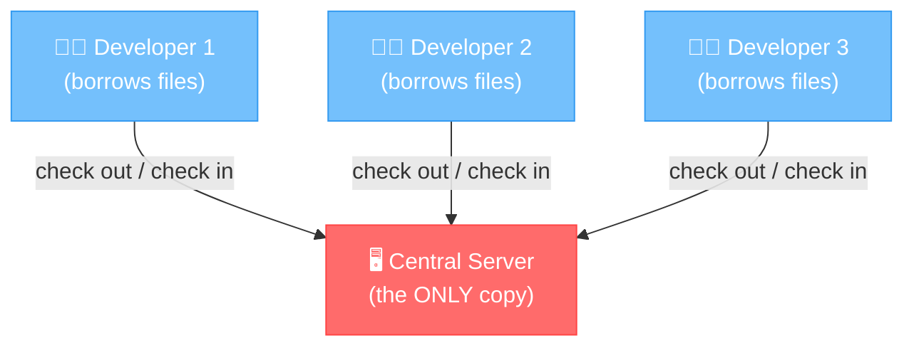
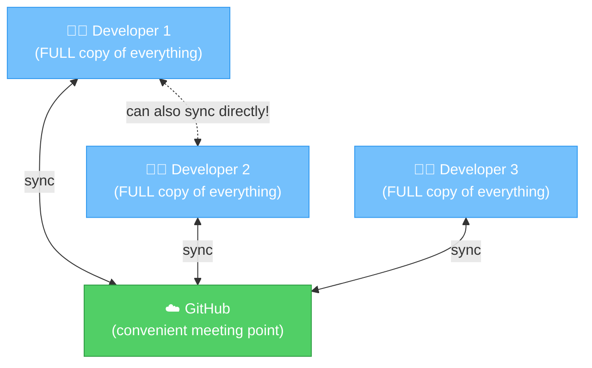
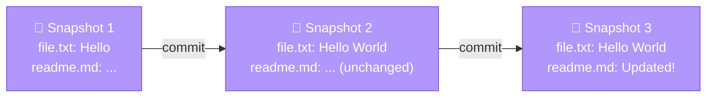

# Chapter 2: Meet Git — Your New Best Friend

[<< Previous: Why Version Control](01_why_version_control.md) | [Next: Installation & Setup >>](03_installation_and_setup.md)

---

So we know *why* version control exists (spoiler: chaos). But there are actually lots of version control tools out there. So why does basically the **entire planet** use one called **Git**?

Let's find out. 🔍

## What Even IS Git?

Git is a **distributed version control system**.

Whoa whoa whoa. That's three fancy words. Let's break them down one at a time:

| Word | What It Means |
|------|--------------|
| **Version Control** | Tracks changes to files over time (you learned this in Chapter 1! 🎉) |
| **System** | It's a tool — a piece of software you install on your computer |
| **Distributed** | Every person has a **complete copy** of the entire project history |

That last one — **distributed** — is the secret sauce. More on that in a minute.

## The Origin Story 🦸

Every superhero has an origin story. Git's is actually pretty great.

The year is **2005**. A brilliant (and famously opinionated) programmer named **Linus Torvalds** — the same person who created Linux — needed a version control tool for the Linux kernel. The one they'd been using (BitKeeper) was no longer free.

So what did Linus do? He built his own. **In about two weeks.** 🤯

His design goals were:
- ⚡ **Speed** — it had to be fast (the Linux kernel is HUGE)
- 🌿 **Branching should be cheap** — creating branches should take milliseconds, not minutes
- 🔒 **Data integrity** — never, ever lose data
- 📦 **Distributed** — everyone gets the full history, no single point of failure

And Git was born. Today, it's used by **over 95% of developers worldwide**. Not bad for a two-week project!

## Centralized vs Distributed — The Library Analogy 📚

This is the one concept that makes Git different from older version control systems. Let's use a metaphor.

### The Old Way: Centralized (like a library)

Imagine there's **one library** in town. It has one copy of every book. When you want to read a book, you go to the library, check it out, and bring it home. While you have it, **nobody else can read it**. When you're done, you return it.

That's how **centralized** version control works (tools like SVN, Perforce):
- There's one central server with the "real" copy
- You "check out" files to work on them
- If the server goes down, nobody can work
- If the server's hard drive dies, you might lose everything



**If the server dies 💀 → everyone loses everything.**

### The Git Way: Distributed (like owning the book)

Now imagine that instead of borrowing from a library, every person **buys their own copy** of the entire book collection. You can read, highlight, take notes — whatever you want. And periodically, everyone meets up and shares their notes with each other.

That's how Git works:
- Every developer has the **complete project history** on their own machine
- You can work offline — on a plane, in a bunker, anywhere
- If any computer dies, every other computer has a full backup
- There's usually a "central" server (like GitHub), but it's a *convenience*, not a requirement



**If GitHub goes down → everyone still has everything. Nobody panics.** 😌

> **💡 There are no dumb questions**
>
> **Q: "Wait, if everyone has the full history, doesn't that use a ton of disk space?"**
>
> A: Great question! Git is incredibly clever about how it stores data. It compresses everything and only stores the *differences* between versions. A project with years of history might only be a few hundred megabytes. Your phone has more storage than most Git repositories will ever need.
>
> **Q: "If there's no central server required, why does everyone use GitHub?"**
>
> A: Convenience! GitHub gives you a nice web interface, pull requests for code review, issue tracking, and a place for your team to sync up. Think of it as a really nice meeting room — you *could* meet in a parking lot, but the meeting room has coffee and whiteboards. ☕

## How Git Thinks: Snapshots, Not Diffs 📸

Here's something that might surprise you. Most version control systems store a list of **changes** (diffs) to each file over time:

```
Version 1: Create file.txt with "Hello"
Version 2: Change line 1 to "Hello World"
Version 3: Add line 2 "Goodbye"
```

Git does something different. Git takes a **snapshot** of your entire project at each commit. Think of it like taking a photo of everything on your desk:



"But wait, doesn't that waste space if most files don't change?"

Nope! Git is smart. If a file hasn't changed, Git doesn't store a new copy — it just stores a **pointer** to the previous version. So you get the speed of snapshots with the efficiency of diffs. Best of both worlds. 🎉

## Git's Superpowers — The Highlight Reel ⚡

Let's recap what makes Git special:

| Superpower | What It Means |
|---|---|
| 🏠 **Local-first** | Almost everything happens on YOUR machine. No internet needed for most operations. |
| ⚡ **Blazing fast** | Creating a branch? Milliseconds. Committing? Milliseconds. Switching branches? Milliseconds. |
| 🌿 **Cheap branching** | Branches are just tiny pointers (40 bytes!). Create hundreds if you want. |
| 🔒 **Data integrity** | Every piece of data is checksummed. Corruption is nearly impossible. |
| 📦 **Distributed** | Full history on every machine. No single point of failure. |
| 🌍 **Universal** | Used by 95%+ of developers. Learn Git once, use it everywhere. |

## Your Mental Model 🧠

Here's how to think about Git going forward. Git is a **time machine + parallel universe generator** for your project:

- **Time machine** — you can go back to any previous state of your project
- **Parallel universe generator** — you can create alternate timelines (branches) to try things out without affecting the "real" timeline
- **Team synchronizer** — multiple people can work in their own universes and merge them together

Keep this mental model in your head. Everything we learn from here on builds on it.

> **🧠 Brain Power**
>
> Based on what you've learned, which of these is true about Git?
>
> A) Git needs an internet connection to make a commit
> B) If GitHub goes down, all your Git history is lost
> C) Creating a branch in Git makes a full copy of all your files
> D) Git stores snapshots of your project, not a list of changes
>
> *(Pause. Think. Don't scroll yet...)*
>
> The answer is **D**! Everything else is a common misconception:
> - A) Git works offline — committing is a local operation
> - B) Your full history is on your machine — GitHub is just a sync point
> - C) Branches are lightweight pointers, not copies

---

## 📝 Pop Quiz: Chapter 2

Test yourself! Click to reveal answers.

**1. Who created Git, and why?**

<details>
<summary>Show answer</summary>

Linus Torvalds created Git in 2005 because the version control tool the Linux kernel team had been using (BitKeeper) was no longer available for free. He built Git in about two weeks with goals of speed, data integrity, and distributed workflows.

</details>

**2. What's the difference between centralized and distributed version control?**

<details>
<summary>Show answer</summary>

In **centralized** VCS, there's one server with the "real" copy — if it dies, you lose everything. In **distributed** VCS (like Git), every developer has a complete copy of the entire project history. There's no single point of failure.

</details>

**3. Does Git store changes (diffs) or snapshots?**

<details>
<summary>Show answer</summary>

Git stores **snapshots** of your entire project at each commit. If a file hasn't changed, Git stores a pointer to the previous version instead of a duplicate — so it's efficient despite taking full snapshots.

</details>

---

🏆 **Level 2 Complete!** You now know WHAT Git is, WHERE it came from, and HOW it thinks. You understand that it's distributed (everyone gets a full copy) and it works with snapshots. Time to actually install this thing!

---

[<< Previous: Why Version Control](01_why_version_control.md) | [Next: Installation & Setup >>](03_installation_and_setup.md)
