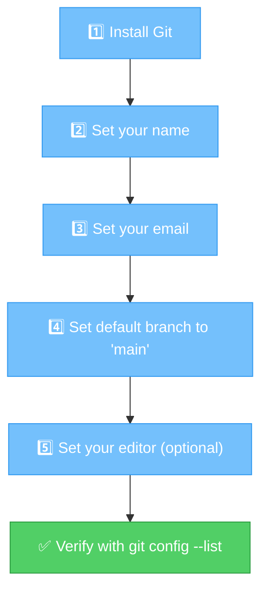

# Chapter 3: Let's Get You Set Up! — Installation & First-Time Setup

[<< Previous: What is Git](02_what_is_git.md) | [Next: Your First Repository >>](04_your_first_repo.md)

---

Alright, enough theory! Let's get your hands dirty. 🛠️

In this chapter, you'll install Git, tell it who you are, and run your very first Git command. By the end, you'll have a working Git setup and the confidence that everything is wired up correctly.

## Step 1: Install Git ⬇️

### macOS 🍎

The easiest way — open your **Terminal** app and type:

```bash
git --version
```

If Git is already installed (it often is on macOS!), you'll see something like:

```
git version 2.39.2
```

If not, macOS will pop up a dialog asking if you want to install the Command Line Developer Tools. Click **Install** and you're done. Seriously. That's it.

> **💡 Where's the Terminal?**
>
> Press `Cmd + Space`, type "Terminal", and hit Enter. Or find it in Applications → Utilities → Terminal.

### Windows 🪟

1. Go to [https://git-scm.com/download/win](https://git-scm.com/download/win)
2. Download the installer — it should start automatically
3. Run the installer
4. **Click Next through everything.** The defaults are fine. Yes, all of them. Don't overthink it.
5. When it's done, open **Git Bash** (it was installed with Git — search for it in your Start Menu)

```bash
git --version
```

You should see:

```
git version 2.43.0.windows.1
```

> **⚠️ Watch it!**
>
> On Windows, use **Git Bash** for everything in this guide — not Command Prompt (cmd) and not PowerShell. Git Bash gives you a Linux-like terminal that makes following along much easier.

### Linux 🐧

**Ubuntu / Debian:**
```bash
sudo apt update
sudo apt install git
```

**Fedora:**
```bash
sudo dnf install git
```

**Arch (btw):**
```bash
sudo pacman -S git
```

Verify it worked:

```bash
git --version
```

```
git version 2.43.0
```

### Did It Work? ✅

No matter which operating system you're on, run this:

```bash
git --version
```

If you see a version number — **do a little dance** 💃🕺. Git is installed!

If you see `command not found` or something scary — don't panic. Close your terminal, open a new one, and try again. Still not working? Check that the installation completed, or search "install git on [your OS]" for help.

## Step 2: Tell Git Who You Are 🪪

Before you can use Git, it needs to know two things about you:

1. **Your name** — this will appear on every change you make
2. **Your email** — same deal

This is important because when you work with a team, everyone needs to know *who* made *which* change. Think of it like signing your work.

Run these two commands (replace with YOUR info, obviously 😄):

```bash
git config --global user.name "Your Name"
git config --global user.email "your.email@example.com"
```

For example:

```bash
git config --global user.name "Ada Lovelace"
git config --global user.email "ada@example.com"
```

> **💡 What does `--global` mean?**
>
> It means "use this setting for ALL my Git projects on this computer." Without `--global`, the setting would only apply to the current project. For now, `--global` is what you want.

> **⚠️ Watch it!**
>
> The email you set here shows up in your commits — and commits that get pushed to GitHub are **public**. If you're using Git for work, use your work email. If you want privacy on personal projects, GitHub offers a no-reply email address in your account settings.

## Step 3: Set Your Default Branch Name 🌿

When you create a new Git repository (we'll do this in the next chapter!), Git creates a first branch. Historically, this was called `master`, but the industry has largely moved to calling it `main`.

Let's set that default:

```bash
git config --global init.defaultBranch main
```

> **💡 There are no dumb questions**
>
> **Q: "What's a branch?"**
>
> A: We'll cover branches in detail in Chapter 8. For now, just think of it as the name of your project's main timeline. `main` is the conventional name, like calling your main street "Main Street." Creative, we know. 😄

## Step 4: Pick Your Text Editor (Optional but Nice) ✏️

When Git needs you to type a longer message (like a detailed commit description), it opens a text editor. By default, this is usually **Vim** — which is... an experience. If you've never used Vim, you might find yourself trapped in it like a digital escape room.

Let's set something friendlier:

**VS Code** (most popular choice):
```bash
git config --global core.editor "code --wait"
```

**Nano** (simple terminal editor):
```bash
git config --global core.editor "nano"
```

**Notepad++** (Windows):
```bash
git config --global core.editor "'C:/Program Files/Notepad++/notepad++.exe' -multiInst -notabbar -nosession -noPlugin"
```

> **🎭 Fireside Chat: Vim vs Literally Any Other Editor**
>
> *A new developer accidentally opens Vim for the first time...*
>
> **New Developer:** "Okay, I'll just type my message and—wait. Why can't I type? What's happening? How do I close this?!"
>
> **Vim:** "To quit, press Escape, then type `:q!`, then press Enter."
>
> **New Developer:** "...what?"
>
> **Vim:** "Or was it `:wq`? Or `ZZ`? Depends on your mood, really."
>
> **New Developer:** *closes laptop lid and walks away*
>
> **Moral of the story:** Set your editor to something you already know. Future you will thank present you. 🙏

## Step 5: Verify Everything 🔍

Let's make sure all your settings are saved. Run:

```bash
git config --list
```

You should see your settings in the output (among other things):

```
user.name=Ada Lovelace
user.email=ada@example.com
init.defaultbranch=main
core.editor=code --wait
```

If you see your name and email — **you're officially ready to Git!** 🎉

You can also check individual settings:

```bash
git config user.name
# Output: Ada Lovelace

git config user.email
# Output: ada@example.com
```

## A Quick Map of What We Just Did 🗺️



---

## 🏋️ Exercise 1: Your First Git Commands!

**Objective:** Install Git, configure your identity, and verify the setup.

**Steps:**

1. Open your terminal (Terminal on macOS/Linux, Git Bash on Windows)

2. Check if Git is installed:
   ```bash
   git --version
   ```

3. If not installed, follow the installation steps for your OS above

4. Set your name:
   ```bash
   git config --global user.name "Your Name Here"
   ```

5. Set your email:
   ```bash
   git config --global user.email "your.email@example.com"
   ```

6. Set your default branch name:
   ```bash
   git config --global init.defaultBranch main
   ```

7. Verify everything:
   ```bash
   git config --list
   ```

**Expected Output:**

You should see (among other lines):
```
user.name=Your Name Here
user.email=your.email@example.com
init.defaultbranch=main
```

**🎯 What You Learned:**

You installed Git, told it who you are, and confirmed everything works. These settings are saved globally — you only need to do this once per computer. Every commit you make will now be stamped with your name and email.

---

🏆 **Level 3 Complete!** Git is installed, configured, and ready to roll. You've run actual commands in a terminal. You're basically a hacker now. 😎 In the next chapter, you'll create your very first Git repository!

---

[<< Previous: What is Git](02_what_is_git.md) | [Next: Your First Repository >>](04_your_first_repo.md)
