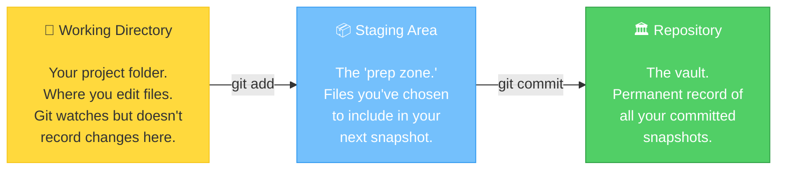
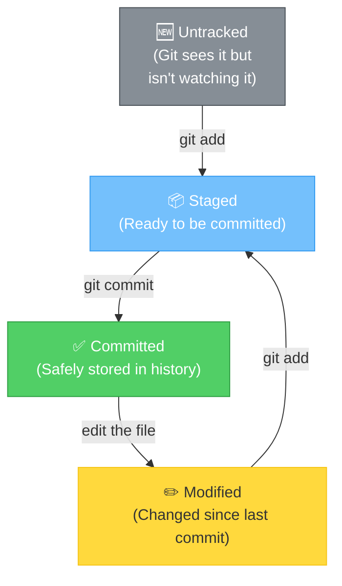

# Chapter 4: Building Your First Time Machine — Your First Repository

[<< Previous: Installation & Setup](03_installation_and_setup.md) | [Next: Add & Commit >>](05_add_and_commit.md)

---

This is it. The moment you've been waiting for. You're about to create your first Git repository — your very own time machine. 🕰️

By the end of this chapter, you'll understand what a repository is, how Git tracks your project, and you'll have typed `git status` approximately 47 times. That's not a bug. That's a feature.

## What IS a Repository? 📦

A **repository** (or "repo" for short) is just a folder on your computer that Git is watching. That's it. Nothing magical about the folder itself — it's the hidden `.git` folder *inside* it that holds all the magic.

Think of it this way:

| Concept | Analogy |
|---|---|
| Regular folder | A room with stuff in it |
| Git repository | The same room, but with a **security camera system** recording everything that happens |

The camera system (Git) silently watches. It records what files are added, changed, or deleted. And you can rewind the footage to any point in time.

## Creating Your First Repo 🎬

Let's do this! Open your terminal and run:

```bash
mkdir ~/git-practice
cd ~/git-practice
```

You just created a new folder called `git-practice` in your home directory and moved into it. Right now, it's just a regular folder. Boring. Let's fix that:

```bash
git init
```

**Output:**

```
Initialized empty Git repository in /Users/yourname/git-practice/.git/
```

🎉 **BOOM!** You just created a Git repository!

What happened? Git created a hidden folder called `.git` inside your project. This folder is Git's brain — it stores all the history, configuration, and tracking data. You can peek at it:

```bash
ls -la
```

**Output:**

```
total 0
drwxr-xr-x  3 yourname  staff   96 Jun 25 10:00 .
drwxr-xr-x  5 yourname  staff  160 Jun 25 10:00 ..
drwxr-xr-x  9 yourname  staff  288 Jun 25 10:00 .git
```

See that `.git` folder? That's where ALL the magic lives.

> **⚠️ Watch it!**
>
> **Never manually edit or delete the `.git` folder** unless you know exactly what you're doing. That folder IS your project's entire history. Deleting it is like ripping the security cameras off the wall and throwing the tape recorder in a lake. Your project folder will still exist, but Git won't know anything about it anymore.

## Your New Best Friend: `git status` 💛

If you learn ONE Git command from this entire guide, make it this one:

```bash
git status
```

This command tells you **everything about the current state** of your repository. Run it now:

```bash
git status
```

**Output:**

```
On branch main

No commits yet

nothing to commit (create/copy files and use "git add" to track)
```

Let's read this like a story:
- **On branch main** — You're on the main timeline (we'll learn about branches later)
- **No commits yet** — You haven't saved any snapshots yet
- **nothing to commit** — There are no changes to record

Git is basically saying: *"Hey, I'm watching this folder, but there's nothing here yet. Give me something to work with!"*

## Let's Give Git Something to Track 📝

Create a file:

```bash
echo "Hello, Git! This is my first file." > hello.txt
```

Now check the status again:

```bash
git status
```

**Output:**

```
On branch main

No commits yet

Untracked files:
  (use "git add <file>..." to include in what will be committed)
	hello.txt

nothing added to commit but untracked files present (use "git add" to track)
```

**OH! Something changed!** Git sees `hello.txt` but it's listed as **"Untracked."** This means Git *sees* the file, but it's not tracking it yet. It's like Git is saying:

*"Hey, I see you dropped a new file in here. Want me to start watching it? If so, use `git add`."*

We'll learn about `git add` and `git commit` in the next chapter. For now, let's understand the big picture.

## The Three Areas — Git's Secret to Organization 🏗️

This is one of the most important concepts in Git. Understand this, and everything else will click.

Git manages your files across **three areas**:



### Let's Use a Packing Analogy 📬

Imagine you're sending a care package to a friend:

1. **Working Directory = Your Desk** 🗃️
   - This is where all your stuff is — papers, books, snacks, random things
   - You're working on stuff, moving things around, making a mess — it's YOUR space
   - Git *sees* what's on your desk, but it doesn't record anything until you tell it to

2. **Staging Area = The Shipping Box** 📦
   - When you decide something is ready to send, you put it in the box
   - You can add things to the box, take things out, rearrange — it's not sealed yet
   - This is your chance to curate exactly what goes into the next shipment
   - In Git, this is where `git add` puts files

3. **Repository = The Post Office Records** 🏛️
   - Once you seal the box and ship it, it's recorded permanently
   - You get a tracking number (a commit hash in Git terms)
   - You can't un-ship it, but you can always see what was in every box you ever sent
   - In Git, `git commit` is sealing and shipping

> **💡 There are no dumb questions**
>
> **Q: "Why do I need a staging area? Why can't I just save directly?"**
>
> A: Great question! The staging area gives you **control over what goes into each commit**. Imagine you changed 5 files, but only 3 of those changes are related to the same task. The staging area lets you commit just those 3, keeping your history clean and organized. It's like being able to pack one box with kitchen items and a separate box with bathroom items, instead of throwing everything together.
>
> **Q: "Can I just skip the staging area?"**
>
> A: Technically yes (there are shortcuts), but we don't recommend it for beginners. The staging area is a feature, not a burden. It gives you a moment to think: "Is this *really* what I want to commit?" That moment of pause has saved countless developers from committing debug code, temporary files, or that embarrassing comment they left in the code.

## File Lifecycle in Git 🔄

A file in a Git repository goes through specific states. Here's the journey:



1. **Untracked** — Git sees the file but isn't tracking it yet
2. **Staged** — You've told Git "include this in the next commit" (`git add`)
3. **Committed** — The file is safely recorded in the repository (`git commit`)
4. **Modified** — You've changed a committed file, and Git notices the difference

And then the cycle repeats: Modified → Staged → Committed → Modified → ...

> **✏️ Sharpen Your Pencil**
>
> Look at the lifecycle diagram above. If you create a brand new file and then run `git status`, what state will the file be in?
>
> <details>
> <summary>Check your answer</summary>
>
> **Untracked!** Git sees the file exists, but since you haven't run `git add` on it yet, it's not being tracked. You'll see it listed under "Untracked files" in the `git status` output.
>
> </details>

## The `git status` Hall of Fame 🏆

You'll see `git status` output in so many variations. Here's a preview of what different states look like:

### Empty repo, no files:
```
nothing to commit (create/copy files and use "git add" to track)
```
*Translation: "I'm bored. Give me something to do."*

### New file, not yet tracked:
```
Untracked files:
    hello.txt
```
*Translation: "I see a new file. Want me to track it?"*

### File added to staging area:
```
Changes to be committed:
    new file: hello.txt
```
*Translation: "This file is packed in the box, ready to be committed."*

### File committed, then modified:
```
Changes not staged for commit:
    modified: hello.txt
```
*Translation: "You changed this file since the last commit. Want to include the changes in the next commit?"*

### Everything committed, nothing to do:
```
nothing to commit, working tree clean
```
*Translation: "Everything is saved. We're good. Go get coffee." ☕*

---

## 🏋️ Exercise 2: Create Your Playground

**Objective:** Create a Git repository and observe how `git status` changes as you create files.

**Steps:**

1. Create a new practice folder and navigate into it:
   ```bash
   mkdir ~/git-practice
   cd ~/git-practice
   ```

2. Initialize a Git repository:
   ```bash
   git init
   ```
   **Expected output:**
   ```
   Initialized empty Git repository in /Users/yourname/git-practice/.git/
   ```

3. Check the status:
   ```bash
   git status
   ```
   **Expected output:**
   ```
   On branch main
   No commits yet
   nothing to commit (create/copy files and use "git add" to track)
   ```

4. Create your first file:
   ```bash
   echo "My first Git adventure!" > adventure.txt
   ```

5. Check the status again:
   ```bash
   git status
   ```
   **Expected output:**
   ```
   Untracked files:
       adventure.txt
   ```

6. Create two more files:
   ```bash
   echo "Favorite color: blue" > about_me.txt
   echo "TODO: learn git" > todo.txt
   ```

7. Check status one more time:
   ```bash
   git status
   ```
   **Expected output:**
   ```
   Untracked files:
       about_me.txt
       adventure.txt
       todo.txt
   ```

**🎯 What You Learned:**

You created a Git repository with `git init`, and you saw how `git status` tells you what's going on. You noticed that new files show up as "Untracked" — Git sees them but isn't recording their changes yet. In the next chapter, you'll learn how to stage and commit these files!

> **🧠 Brain Power**
>
> We created 3 files but haven't committed any of them yet. In the Three Areas model, where do these files live right now?
>
> Answer: They're in the **Working Directory** only. They haven't been staged (no `git add`) or committed (no `git commit`). Git knows they exist but isn't tracking them.

---

🏆 **Level 4 Complete!** You've created your first repo, met `git status` (your new best friend), and understand the Three Areas of Git. Your files are sitting in the Working Directory, waiting to be staged and committed. Let's do exactly that in the next chapter!

---

[<< Previous: Installation & Setup](03_installation_and_setup.md) | [Next: Add & Commit >>](05_add_and_commit.md)
