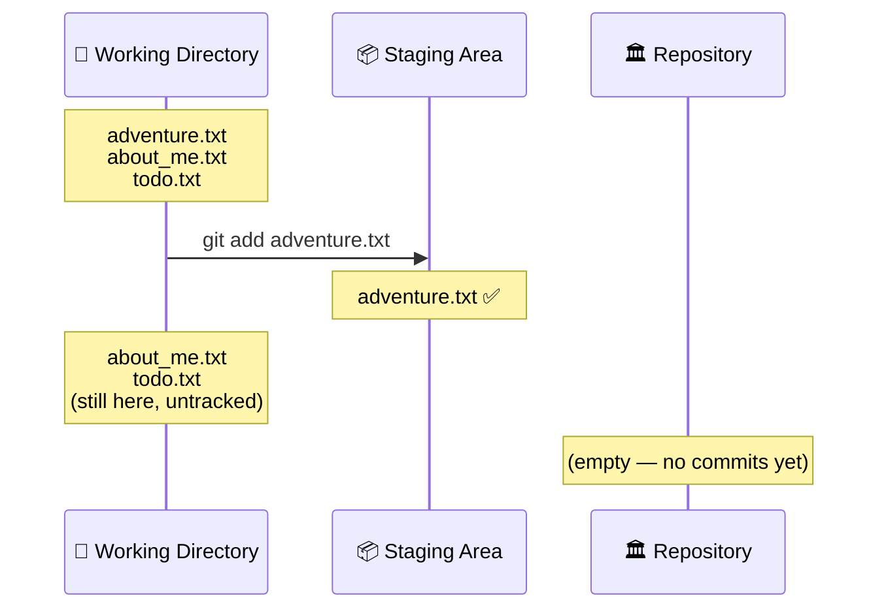
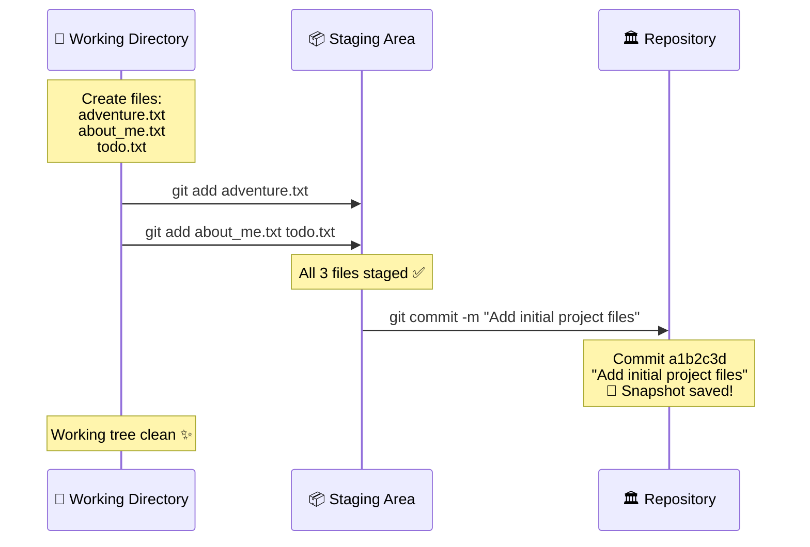

# Chapter 5: Snapshot Time! — Add & Commit

[<< Previous: Your First Repository](04_your_first_repo.md) | [Next: Git History >>](06_git_history.md)

---

You've got a repo. You've got files. Git is watching them like a hawk. But it's not *recording* anything yet. Time to change that.

In this chapter, you'll learn the two most important Git commands you'll ever use: `git add` and `git commit`. You'll use these two commands roughly ten thousand times in your career. No pressure. 😄

## The Two-Step Dance 💃🕺

Remember the Three Areas from Chapter 4?

1. **Working Directory** → where you edit files
2. **Staging Area** → where you prepare your next commit
3. **Repository** → where commits live permanently

Getting your changes saved in Git is a **two-step dance**:

| Step | Command | What It Does |
|------|---------|-------------|
| 1 | `git add` | Moves changes from Working Directory → Staging Area |
| 2 | `git commit` | Moves changes from Staging Area → Repository |

Think of it like sending a package:
- `git add` = putting items into the shipping box 📦
- `git commit` = sealing the box with a label and shipping it 📮

Let's see this in action.

## `git add` — Putting Items in the Box 📦

Let's pick up where Exercise 2 left off. If you still have your `~/git-practice` folder with those 3 untracked files, great! If not, let's recreate it:

```bash
mkdir -p ~/git-practice && cd ~/git-practice
git init  # skip if you already did this
echo "My first Git adventure!" > adventure.txt
echo "Favorite color: blue" > about_me.txt
echo "TODO: learn git" > todo.txt
```

Check the status:

```bash
git status
```

```
Untracked files:
    about_me.txt
    adventure.txt
    todo.txt
```

Three untracked files. Let's stage ONE of them:

```bash
git add adventure.txt
```

No output? That's normal. Git is the strong, silent type when things go well. Check the status to see what happened:

```bash
git status
```

```
Changes to be committed:
    new file:   adventure.txt

Untracked files:
    about_me.txt
    todo.txt
```

**Look at that!** `adventure.txt` moved from "Untracked" to "Changes to be committed." It's now in the staging area — sitting in the box, ready to be shipped.

The other two files? Still untracked. Git didn't touch them because we only added `adventure.txt`.

Here's what just happened:



### Adding Multiple Files

You can add files one at a time, or several at once:

```bash
# Add specific files
git add about_me.txt todo.txt

# Or add EVERYTHING at once
git add .
```

> **⚠️ Watch it!**
>
> `git add .` (with the dot) adds **everything** in the current folder. That's convenient, but be careful — it might add files you don't want to track (log files, secret keys, build artifacts). We'll learn about `.gitignore` in Chapter 13 to prevent this. For now, just be aware.

Let's add the remaining files:

```bash
git add about_me.txt todo.txt
git status
```

```
Changes to be committed:
    new file:   about_me.txt
    new file:   adventure.txt
    new file:   todo.txt
```

All three files are now staged! The box is packed. Time to seal it. 📦✅

## `git commit` — Seal It and Ship It 📮

A **commit** is a snapshot of your project at a specific moment in time. Every commit needs a **message** — a short note explaining what you did and why. This is incredibly important because future-you (and your teammates) will read these messages to understand the project's history.

```bash
git commit -m "Add initial project files"
```

**Output:**

```
[main (root-commit) a1b2c3d] Add initial project files
 3 files changed, 3 insertions(+)
 create mode 100644 about_me.txt
 create mode 100644 adventure.txt
 create mode 100644 todo.txt
```

🎉 **YOU JUST MADE YOUR FIRST COMMIT!** 🎉

Let's break down that output:
- `main` — you're on the `main` branch
- `root-commit` — this is the very first commit in the repo
- `a1b2c3d` — the commit's unique ID (yours will be different — every commit gets its own fingerprint)
- `Add initial project files` — your commit message
- `3 files changed, 3 insertions(+)` — a summary of what was included

Now check the status:

```bash
git status
```

```
On branch main
nothing to commit, working tree clean
```

*"Nothing to commit, working tree clean."* — This is Git's way of saying: "Everything is saved. We're good. Go get coffee." ☕

## The Complete Flow — One More Time

Here's the full journey your files just took:



## Writing Good Commit Messages ✍️

Your commit messages are a gift to future-you. Write them well, and you'll thank yourself later. Write them badly, and you'll curse yourself later.

> **✏️ Sharpen Your Pencil**
>
> Which of these commit messages is the best? (Think about it before reading the answer!)
>
> A) `"changes"`
> B) `"updated stuff"`
> C) `"Fix login button not responding on mobile devices"`
> D) `"asdfasdf"`
> E) `"Wednesday's work"`
>
> <details>
> <summary>The answer</summary>
>
> **C** is the winner! 🏆 It tells you exactly WHAT was fixed and WHERE. If you're reading the history 6 months from now, message C is the only one that gives you useful information.
>
> A, B, D, and E are all crimes against developer-kind. Don't be that person. 😄
>
> </details>

### The Golden Rules of Commit Messages

| ✅ Do | ❌ Don't |
|-------|---------|
| Use **imperative mood**: "Add feature" not "Added feature" | Write vague messages: "fix stuff" |
| Be **specific**: "Fix crash when user submits empty form" | Be lazy: "changes" or "update" |
| Keep it **concise**: aim for under 72 characters | Write a novel in the subject line |
| Explain **why**, not just what (when it's not obvious) | Use commit messages as a diary: "Monday morning work" |

Think of it this way: your commit message should complete the sentence:

> *"If applied, this commit will..."* **[your message here]**

- ✅ "If applied, this commit will **Add user authentication**" — makes sense!
- ❌ "If applied, this commit will **some changes**" — what? 🤨

## Making Changes and Committing Again 🔄

Let's modify a file and go through the cycle again. Edit `todo.txt`:

```bash
echo "TODO: learn git add" >> todo.txt
echo "TODO: learn git commit" >> todo.txt
```

Check what Git sees:

```bash
git status
```

```
Changes not staged for commit:
    modified:   todo.txt
```

Git detected the change! The file is **modified** but **not staged**. Let's see exactly what changed:

```bash
git diff
```

```diff
diff --git a/todo.txt b/todo.txt
index 1234567..abcdefg 100644
--- a/todo.txt
+++ b/todo.txt
@@ -1 +1,3 @@
 TODO: learn git
+TODO: learn git add
+TODO: learn git commit
```

Lines starting with `+` are **additions** (green in most terminals). Lines starting with `-` would be **deletions** (red). This is `git diff` — your "spot the difference" tool. More on this in a moment.

Now let's stage and commit:

```bash
git add todo.txt
git commit -m "Add more learning goals to todo list"
```

```
[main b2c3d4e] Add more learning goals to todo list
 1 file changed, 2 insertions(+)
```

Two commits in the bag! 🎒

## `git diff` — Spot the Difference 🔍

`git diff` shows you **exactly what changed** in your files since the last commit (or since the last staging). It's incredibly useful before committing — it lets you review your changes and make sure you're not about to commit something you didn't intend to.

Here's how to read it:

```diff
- This line was removed (shown in red)
+ This line was added (shown in green)
  This line was unchanged
```

Some handy variations:

| Command | Shows |
|---------|-------|
| `git diff` | Changes in working directory (not yet staged) |
| `git diff --staged` | Changes that are staged (ready to commit) |
| `git diff HEAD` | ALL changes (staged + unstaged) since last commit |

> **💡 There are no dumb questions**
>
> **Q: "I ran `git diff` but it shows nothing, even though I changed files!"**
>
> A: You probably already staged the changes with `git add`. Run `git diff --staged` instead — that shows what's in the staging area. Plain `git diff` only shows *unstaged* changes.
>
> **Q: "Can I commit without the `-m` flag?"**
>
> A: Yes! If you just run `git commit` (without `-m`), Git will open your text editor so you can write a longer, multi-line message. This is great for commits that need more explanation. The `-m` flag is a shortcut for quick, one-line messages.

## `git log` — Reading Your Diary 📖

After making commits, you can view your history:

```bash
git log
```

```
commit b2c3d4e... (HEAD -> main)
Author: Your Name <your.email@example.com>
Date:   Wed Jun 25 10:30:00 2026 +0530

    Add more learning goals to todo list

commit a1b2c3d...
Author: Your Name <your.email@example.com>
Date:   Wed Jun 25 10:15:00 2026 +0530

    Add initial project files
```

That's your project's entire history! Two commits, shown newest-first. Each one has:
- A unique **hash** (that long string of characters)
- The **author** (that's you!)
- The **date**
- The **message**

For a more compact view:

```bash
git log --oneline
```

```
b2c3d4e (HEAD -> main) Add more learning goals to todo list
a1b2c3d Add initial project files
```

Much cleaner! We'll dive deeper into `git log` in the next chapter.

---

## 🏋️ Exercise 3: The Three-File Challenge

**Objective:** Practice the add-commit workflow by committing files one at a time with meaningful messages.

**Steps:**

1. Navigate to your practice repo:
   ```bash
   cd ~/git-practice
   ```

2. Create three new files:
   ```bash
   echo "Git was created by Linus Torvalds in 2005" > facts.txt
   echo "Practice makes perfect" > notes.txt
   echo "Buy milk, learn Git, save the world" > shopping.txt
   ```

3. Check status — all three should be untracked:
   ```bash
   git status
   ```

4. Stage and commit **only** `facts.txt`:
   ```bash
   git add facts.txt
   git commit -m "Add fun facts about Git"
   ```

5. Stage and commit **only** `notes.txt`:
   ```bash
   git add notes.txt
   git commit -m "Add study notes file"
   ```

6. Stage and commit **only** `shopping.txt`:
   ```bash
   git add shopping.txt
   git commit -m "Add shopping list with life goals"
   ```

7. View your history:
   ```bash
   git log --oneline
   ```

**Expected Output:**
```
<hash> Add shopping list with life goals
<hash> Add study notes file
<hash> Add fun facts about Git
<hash> Add more learning goals to todo list
<hash> Add initial project files
```

**🎯 What You Learned:**

You practiced committing files individually — each commit captures one logical change with a clear message. This keeps your history clean and meaningful. Notice how `git log --oneline` tells a clear story of what happened in your project.

---

## 🏋️ Exercise 4: The Detective

**Objective:** Modify a file, use `git diff` to inspect the changes, then commit.

**Steps:**

1. Modify `facts.txt` — add a second line:
   ```bash
   echo "Git is used by over 95% of developers worldwide" >> facts.txt
   ```

2. See what changed:
   ```bash
   git diff
   ```
   **Expected output:**
   ```diff
   diff --git a/facts.txt b/facts.txt
   --- a/facts.txt
   +++ b/facts.txt
   @@ -1 +1,2 @@
    Git was created by Linus Torvalds in 2005
   +Git is used by over 95% of developers worldwide
   ```

3. Stage the change:
   ```bash
   git add facts.txt
   ```

4. Now try `git diff` again:
   ```bash
   git diff
   ```
   **Expected output:** Nothing! The change is staged now.

5. Try `git diff --staged`:
   ```bash
   git diff --staged
   ```
   **Expected output:** Now you see the diff — because `--staged` shows what's in the staging area.

6. Commit:
   ```bash
   git commit -m "Add worldwide usage statistic to facts"
   ```

7. Verify:
   ```bash
   git status
   ```
   **Expected output:**
   ```
   nothing to commit, working tree clean
   ```

**🎯 What You Learned:**

You used `git diff` to inspect changes before committing — like a detective examining evidence. You also discovered the difference between `git diff` (unstaged changes) and `git diff --staged` (staged changes). This is a crucial habit: always review your changes before committing!

---

## 📝 Pop Quiz: Chapter 5

**1. What does `git add` do?**

<details>
<summary>Show answer</summary>

`git add` moves changes from the **Working Directory** to the **Staging Area**. It tells Git "include these changes in my next commit." The files aren't saved permanently until you run `git commit`.

</details>

**2. What's the difference between `git diff` and `git diff --staged`?**

<details>
<summary>Show answer</summary>

- `git diff` shows changes in the **Working Directory** that haven't been staged yet
- `git diff --staged` shows changes in the **Staging Area** that are ready to be committed

If you stage all your changes, `git diff` will show nothing, but `git diff --staged` will show everything you're about to commit.

</details>

**3. Which commit message is better: "Update file" or "Add error handling for empty user input"?**

<details>
<summary>Show answer</summary>

**"Add error handling for empty user input"** is far better! It's specific, uses imperative mood, and tells future readers exactly what the commit does. "Update file" tells you nothing useful.

</details>

---

🏆 **Level 5 Complete!** You now know the fundamental Git workflow: **edit → add → commit**. You can stage files selectively, write good commit messages, inspect changes with `git diff`, and view history with `git log`. This is the loop you'll repeat for the rest of your Git life. It only gets more interesting from here!

---

[<< Previous: Your First Repository](04_your_first_repo.md) | [Next: Git History >>](06_git_history.md)
