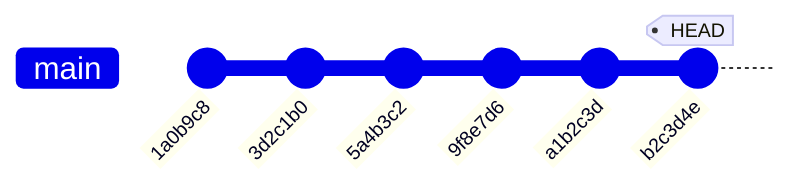

# Chapter 6: Reading Your Diary — Understanding Git History

[<< Previous: Add & Commit](05_add_and_commit.md) | [Next: Undoing Things >>](07_undoing_things.md)

---

You've been making commits like a pro. Each one is a snapshot — a moment frozen in time. But what's the point of having a time machine if you don't know how to *read the timeline*?

In this chapter, you'll learn how to explore your project's history like a time-traveling detective. 🕵️‍♀️

## `git log` — The Full Story 📜

You've already seen the basic `git log`. Let's look at it more carefully:

```bash
git log
```

```
commit b2c3d4e5f6a7b8c9d0e1f2a3b4c5d6e7f8a9b0c1 (HEAD -> main)
Author: Ada Lovelace <ada@example.com>
Date:   Wed Jun 25 10:30:00 2026 +0530

    Add worldwide usage statistic to facts

commit a1b2c3d4e5f6a7b8c9d0e1f2a3b4c5d6e7f8a9b0
Author: Ada Lovelace <ada@example.com>
Date:   Wed Jun 25 10:25:00 2026 +0530

    Add shopping list with life goals

commit ...
```

Each entry is one commit. Let's decode the parts:

| Part | What It Is |
|------|-----------|
| `commit b2c3d4e5f6...` | The **commit hash** — a unique 40-character fingerprint for this commit. No two commits in the world have the same hash. |
| `(HEAD -> main)` | Tells you where you are right now. More on HEAD in a moment! |
| `Author: Ada Lovelace <ada@...>` | Who made this commit (from your `git config`) |
| `Date: Wed Jun 25 10:30:00 2026` | When it was committed |
| `Add worldwide usage statistic...` | The commit message — your note from the past |

## `git log --oneline` — The Short Version 📋

When you just want a quick overview:

```bash
git log --oneline
```

```
b2c3d4e (HEAD -> main) Add worldwide usage statistic to facts
a1b2c3d Add shopping list with life goals
9f8e7d6 Add study notes file
5a4b3c2 Add fun facts about Git
3d2c1b0 Add more learning goals to todo list
1a0b9c8 Add initial project files
```

This is the "headlines-only" view. Just the short hash (first 7 characters — enough to be unique) and the message. Clean. Scannable. Beautiful.

> **💡 Pro tip:** You can also make the log look fancy with a graph:
> ```bash
> git log --oneline --graph --all
> ```
> This will draw a visual tree of branches (super useful once we get to Chapter 8!).

## Understanding Commit Hashes 🔑

Every commit gets a **hash** — a long string like `b2c3d4e5f6a7b8c9d0e1f2a3b4c5d6e7f8a9b0c1`.

This is generated by a mathematical formula (SHA-1) from the commit's content, author, date, message, and parent commit. It's like a fingerprint — **unique to that exact commit.**

The cool thing? You only need to type enough characters to be unique. Usually the first **7 characters** are enough:

```bash
# These are equivalent:
git show b2c3d4e5f6a7b8c9d0e1f2a3b4c5d6e7f8a9b0c1
git show b2c3d4e
```

## `git show` — Zoom In on One Moment ⏱️

Want to see exactly what a specific commit did? Use `git show` with the commit hash:

```bash
git show b2c3d4e
```

```
commit b2c3d4e (HEAD -> main)
Author: Ada Lovelace <ada@example.com>
Date:   Wed Jun 25 10:30:00 2026 +0530

    Add worldwide usage statistic to facts

diff --git a/facts.txt b/facts.txt
--- a/facts.txt
+++ b/facts.txt
@@ -1 +1,2 @@
 Git was created by Linus Torvalds in 2005
+Git is used by over 95% of developers worldwide
```

It shows you:
1. The commit metadata (who, when, what message)
2. The actual **diff** — exactly what lines were added or removed

This is like zooming into one photo in your album and seeing every detail.

## `git diff` Between Commits — Compare Two Moments 🔄

You can compare any two commits to see what changed between them:

```bash
git diff a1b2c3d b2c3d4e
```

This shows everything that changed from commit `a1b2c3d` to commit `b2c3d4e`. Lines with `+` were added, lines with `-` were removed.

You can also use this shortcut to compare a commit with the one before it:

```bash
git diff HEAD~1 HEAD
```

Where `HEAD~1` means "one commit before HEAD" (the current commit).

## HEAD — "You Are Here" 📍

You've seen the word `HEAD` pop up a few times. Let's explain it properly.

**HEAD** is a pointer that tells Git **where you are right now** in the timeline. It's like the "You Are Here" pin on a mall map. 🗺️



HEAD usually points to the **latest commit on your current branch**. When you make a new commit, HEAD moves forward to point at it.

You can use HEAD in commands as a shortcut:

| Shortcut | Meaning |
|----------|---------|
| `HEAD` | The current commit (where you are now) |
| `HEAD~1` | One commit before the current one |
| `HEAD~2` | Two commits back |
| `HEAD~3` | Three commits back |

So `git diff HEAD~2 HEAD` means "show me everything that changed in the last two commits."

> **💡 There are no dumb questions**
>
> **Q: "What happens if HEAD gets 'detached'? That sounds terrifying."**
>
> A: Don't worry — it sounds scarier than it is! A "detached HEAD" just means you've checked out a specific commit instead of a branch. It's like stepping off the train to look at a landmark — you're not lost, you just need to get back on the train (switch back to a branch). We cover this in the Troubleshooting appendix!
>
> **Q: "Can I search through my commit history?"**
>
> A: Absolutely! Try `git log --grep="keyword"` to search commit messages, or `git log -- filename` to see only commits that affected a specific file. Git log has tons of options!

## Useful `git log` Variations 🎛️

Here's a cheat table of the most useful `git log` flavors:

| Command | What You Get |
|---------|-------------|
| `git log` | Full log with all details |
| `git log --oneline` | Compact one-line-per-commit view |
| `git log --oneline --graph` | Compact view with branch visualization |
| `git log -n 5` | Show only the last 5 commits |
| `git log --author="Ada"` | Show only commits by a specific author |
| `git log -- facts.txt` | Show only commits that changed `facts.txt` |
| `git log --grep="fix"` | Show only commits with "fix" in the message |
| `git log --since="2026-06-01"` | Show commits since a specific date |
| `git log --oneline --all` | Show commits from ALL branches (not just current) |

---

## 🏋️ Exercise 5: Time Traveler

**Objective:** Explore your project history using `git log`, `git show`, and `git diff`.

**Steps:**

1. Navigate to your practice repo:
   ```bash
   cd ~/git-practice
   ```

2. View the compact history:
   ```bash
   git log --oneline
   ```
   You should see all your commits listed newest-first.

3. **Copy a commit hash** from the output — pick any commit that isn't the latest one.

4. Inspect that commit with `git show`:
   ```bash
   git show <paste-the-hash-here>
   ```
   Read the output: the author, date, message, and the exact diff.

5. Compare the oldest and newest commits:
   ```bash
   git diff HEAD~4 HEAD
   ```
   *(Adjust the number based on how many commits you have)*

   This shows you EVERYTHING that changed across those commits.

6. Look at only the commits that affected `facts.txt`:
   ```bash
   git log --oneline -- facts.txt
   ```

7. Try the fancy graph view:
   ```bash
   git log --oneline --graph --all
   ```
   Right now it's just a straight line (one branch). This gets exciting in Chapter 8!

**Expected Results:**

- `git log --oneline` shows all commits in a clean list
- `git show <hash>` shows the full details and diff for one commit
- `git diff HEAD~4 HEAD` shows accumulated changes across multiple commits
- `git log --oneline -- facts.txt` shows only commits that touched `facts.txt`

**🎯 What You Learned:**

You can navigate your project's history! You can see what any commit did (`git show`), compare any two points in time (`git diff`), and filter the log to find exactly what you're looking for. You're officially a time-traveling detective. 🕵️‍♂️

---

## 📝 Pop Quiz: Chapter 6

**1. What does HEAD point to?**

<details>
<summary>Show answer</summary>

HEAD points to the **current commit** you're on — usually the latest commit on your current branch. It's like a "You Are Here" marker. When you make a new commit, HEAD automatically moves forward to point at it.

</details>

**2. How would you see only the last 3 commits?**

<details>
<summary>Show answer</summary>

```bash
git log -n 3
```

Or in compact form:

```bash
git log --oneline -n 3
```

The `-n` flag limits how many commits are shown.

</details>

**3. What's the difference between `git log` and `git show`?**

<details>
<summary>Show answer</summary>

- `git log` shows a **list** of commits (the timeline)
- `git show <hash>` shows the **details of one specific commit** — including the full diff of what changed

Think of `git log` as the table of contents, and `git show` as reading one specific chapter.

</details>

---

🏆 **Level 6 Complete!** You can now explore your project's history like a pro. You know how to read commits, compare different points in time, and filter the log. Next up — what happens when you make a mistake? Spoiler: Git has your back.

---

[<< Previous: Add & Commit](05_add_and_commit.md) | [Next: Undoing Things >>](07_undoing_things.md)
