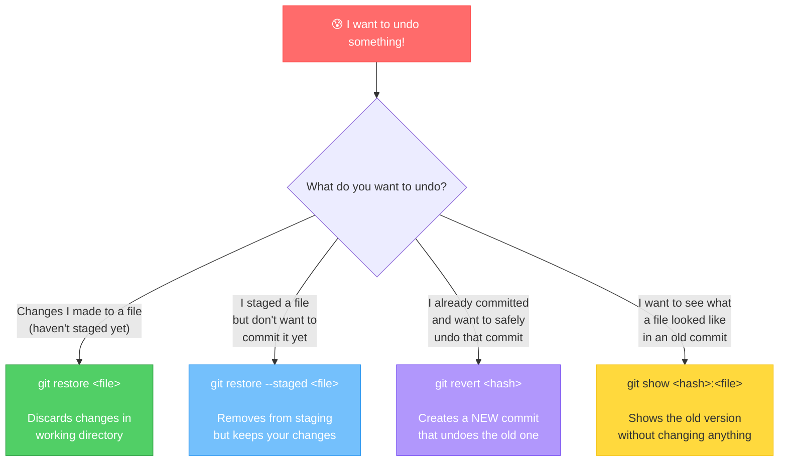

# Chapter 7: Oops! Ctrl+Z for Git — Undoing Things

[<< Previous: Git History](06_git_history.md) | [Next: Branching >>](08_branching.md)

---

We all make mistakes. You'll edit the wrong file. You'll commit something you shouldn't have. You'll write a commit message with a typo. It happens. The important thing is: **Git doesn't judge, and Git has an undo button for almost everything.** 🙏

This chapter is your safety net. Bookmark it. You'll come back to it. Everyone does.

## The "I Want to Undo Something" Decision Tree 🌳

Before we dive into commands, here's the big picture. When you need to undo something, the first question is: **what exactly do you want to undo?**



Keep this diagram in mind as we explore each scenario.

## Scenario 1: "I Changed a File and Want to Un-Change It" ✏️❌

You edited a file but haven't staged it yet. You want to throw away those changes and go back to how the file looked at the last commit.

```bash
# Make a change
echo "THIS IS A MISTAKE" >> adventure.txt

# Check - yep, it's modified
git status
# Changes not staged for commit:
#     modified:   adventure.txt

# Undo the change!
git restore adventure.txt

# Check again - it's clean!
git status
# nothing to commit, working tree clean
```

`git restore <file>` **discards your working directory changes** and restores the file to its last committed state.

> **⚠️ Watch it!**
>
> `git restore` permanently throws away your uncommitted changes to that file. There is **no undo for the undo**. Once those changes are gone, they're gone. If you're not sure, maybe commit your changes on a branch first (Chapter 8) before discarding them.

### What about `git checkout -- <file>`?

You might see this in older tutorials:

```bash
git checkout -- adventure.txt  # old way
git restore adventure.txt      # new way (Git 2.23+)
```

They do the same thing. `git restore` was introduced to make the command clearer — `git checkout` was overloaded with too many different jobs. Use `git restore` — it's the modern way. 👍

## Scenario 2: "I Staged a File But Changed My Mind" 📦↩️

You ran `git add` on a file, but now you don't want it in the next commit. You want to **unstage** it — take it out of the box — but keep your changes in the working directory.

```bash
# Make a change and stage it
echo "Another line" >> notes.txt
git add notes.txt

# Check - it's staged
git status
# Changes to be committed:
#     modified:   notes.txt

# Unstage it! (keep the changes, just remove from staging)
git restore --staged notes.txt

# Check again - changes are still there, just not staged
git status
# Changes not staged for commit:
#     modified:   notes.txt
```

`git restore --staged <file>` removes the file from the staging area, but your changes are **still in the working directory**. It's like taking the item back out of the shipping box — the item still exists, it's just on your desk again.

> **💡 Think of it this way:**
>
> | Command | What It Undoes | Your Changes? |
> |---------|---------------|---------------|
> | `git restore <file>` | Working directory changes | **Gone forever** ⚠️ |
> | `git restore --staged <file>` | Staging (git add) | **Still in your files** ✅ |

## Scenario 3: "I Committed Something I Shouldn't Have" 📮😬

You've already committed. The snapshot is saved. But it was wrong — maybe a bug, or a file that shouldn't have been included. What now?

**Enter `git revert` — Git's polite apology letter.** 📝

`git revert` doesn't delete the bad commit. Instead, it creates a **new commit** that does the exact opposite of the bad one. If the bad commit added a line, the revert commit removes it. If the bad commit deleted a file, the revert commit brings it back.

Why? Because history is sacred. In a team environment, deleting commits can cause chaos. Reverting is the safe, responsible way to undo.

```bash
# Let's make a "bad" commit
echo "TERRIBLE IDEA: delete everything on Friday" >> todo.txt
git add todo.txt
git commit -m "Add a terrible idea to the todo list"

# Check the log
git log --oneline
# d4e5f6a (HEAD -> main) Add a terrible idea to the todo list
# b2c3d4e Add worldwide usage statistic to facts
# ...

# Revert the bad commit
git revert d4e5f6a
```

Git will open your editor to write a revert commit message. The default message is fine — it says something like `Revert "Add a terrible idea to the todo list"`. Save and close.

```
[main e5f6a7b] Revert "Add a terrible idea to the todo list"
 1 file changed, 1 deletion(-)
```

Now check the log:

```bash
git log --oneline
# e5f6a7b (HEAD -> main) Revert "Add a terrible idea to the todo list"
# d4e5f6a Add a terrible idea to the todo list
# b2c3d4e Add worldwide usage statistic to facts
# ...
```

Both commits are in the history — the bad one AND the fix. Total transparency. The file is back to normal, and the history tells the full story of what happened.

> **🎭 Fireside Chat: Revert vs Reset**
>
> *Revert and Reset sat down for coffee...*
>
> **Revert:** "I fix mistakes by politely creating a new commit that undoes the damage. History stays clean, everyone can see what happened."
>
> **Reset:** "I fix mistakes by *rewriting history*. It's like the mistake never happened."
>
> **Revert:** "But... doesn't that confuse your teammates? They pulled the old commit, and now it just... doesn't exist?"
>
> **Reset:** "Yeah, well... it's complicated."
>
> **Revert:** "I'm safe for shared branches. You can use me on `main` without breaking anyone's setup."
>
> **Reset:** "True. I'm better for local branches that nobody else has seen yet."
>
> **Revert:** "So for beginners..."
>
> **Reset:** "...use Revert. Yeah. I'll wait." 😤
>
> **Bottom line:** Use `git revert` for shared/public commits. `git reset` exists but is an advanced topic — we'll keep it off the table for now.

## Scenario 4: "I Want to See an Old Version of a File" 👀

Sometimes you don't want to undo anything — you just want to *peek* at how a file looked at a specific point in history:

```bash
# See how facts.txt looked in a specific commit
git show a1b2c3d:facts.txt
```

This **doesn't change anything** in your working directory. It just displays the file content from that commit. Safe and read-only!

## Quick Reference: The Undo Toolbox 🧰

| Situation | Command | Danger Level |
|-----------|---------|-------------|
| Discard changes to a file (not staged) | `git restore <file>` | ⚠️ Changes lost forever |
| Unstage a file (keep changes) | `git restore --staged <file>` | ✅ Safe — changes preserved |
| Undo an entire commit (publicly safe) | `git revert <hash>` | ✅ Safe — creates new commit |
| See old version of a file (read-only) | `git show <hash>:<file>` | ✅ Totally safe |

---

## 🏋️ Exercise 6: The Undo Dance

**Objective:** Practice all three undo scenarios so they become muscle memory.

### Part A: Discard Working Directory Changes

1. Navigate to your practice repo:
   ```bash
   cd ~/git-practice
   ```

2. Make a change to `adventure.txt`:
   ```bash
   echo "This line is a mistake and I want it gone" >> adventure.txt
   ```

3. Verify the change is there:
   ```bash
   git diff
   ```
   You should see the new line with a `+` prefix.

4. Discard the change:
   ```bash
   git restore adventure.txt
   ```

5. Verify it's gone:
   ```bash
   git diff
   ```
   **Expected output:** Nothing! The change is gone. `git status` should show a clean tree.

### Part B: Unstage a File

1. Make a change and stage it:
   ```bash
   echo "Accidentally staged this" >> notes.txt
   git add notes.txt
   ```

2. Verify it's staged:
   ```bash
   git status
   ```
   You should see `notes.txt` under "Changes to be committed."

3. Unstage it:
   ```bash
   git restore --staged notes.txt
   ```

4. Verify it's unstaged but changes remain:
   ```bash
   git status
   ```
   **Expected:** `notes.txt` should now be under "Changes not staged for commit" — your changes are still there, just not staged.

5. Clean up — discard the working change too:
   ```bash
   git restore notes.txt
   ```

### Part C: Revert a Commit

1. Make a bad commit:
   ```bash
   echo "DEPLOY TO PRODUCTION ON FRIDAY AT 5PM" >> todo.txt
   git add todo.txt
   git commit -m "Add a dangerously bad idea"
   ```

2. Check the log to get the commit hash:
   ```bash
   git log --oneline -n 3
   ```

3. Revert that commit (use the hash from your output):
   ```bash
   git revert <hash-of-bad-commit>
   ```
   When the editor opens, save the default message and close.

4. Check the log:
   ```bash
   git log --oneline -n 4
   ```

   **Expected:** You should see both the bad commit AND the revert commit:
   ```
   <hash> Revert "Add a dangerously bad idea"
   <hash> Add a dangerously bad idea
   <hash> ...
   ```

5. Verify the file is fixed:
   ```bash
   cat todo.txt
   ```
   The bad line should be gone!

**🎯 What You Learned:**

You practiced three levels of undo: discarding working changes (`git restore`), unstaging files (`git restore --staged`), and reverting commits (`git revert`). You now have a safety net for any situation. The key takeaway: committed changes are never truly lost in Git — you can always revert.

---

## 📝 Pop Quiz: Chapter 7

**1. You edited a file but haven't staged it. How do you discard the changes?**

<details>
<summary>Show answer</summary>

```bash
git restore <filename>
```

This discards your working directory changes and restores the file to its last committed state. Warning: this is permanent — the unstaged changes are gone forever!

</details>

**2. You ran `git add` on a file by accident. How do you unstage it WITHOUT losing your changes?**

<details>
<summary>Show answer</summary>

```bash
git restore --staged <filename>
```

This removes the file from the staging area but keeps your changes in the working directory. The file goes back to "modified but not staged" status.

</details>

**3. Why is `git revert` safer than `git reset` for shared branches?**

<details>
<summary>Show answer</summary>

`git revert` creates a **new commit** that undoes the bad commit — history is preserved. Everyone on the team can see what happened and pull the fix normally.

`git reset` rewrites history — it makes commits disappear. If teammates have already pulled the old commits, they'll have conflicts and confusion. That's why `git revert` is the safe choice for any branch that others have access to.

</details>

---

🏆 **Level 7 Complete!** You've mastered Git's undo system. You can discard changes, unstage files, and revert commits with confidence. Mistakes are no longer scary — they're just part of the process. Next up: the most exciting feature in Git — **branches!** 🌿

---

[<< Previous: Git History](06_git_history.md) | [Next: Branching >>](08_branching.md)
