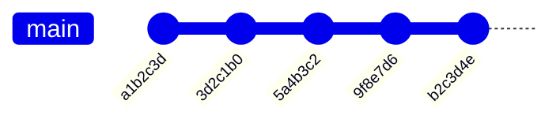
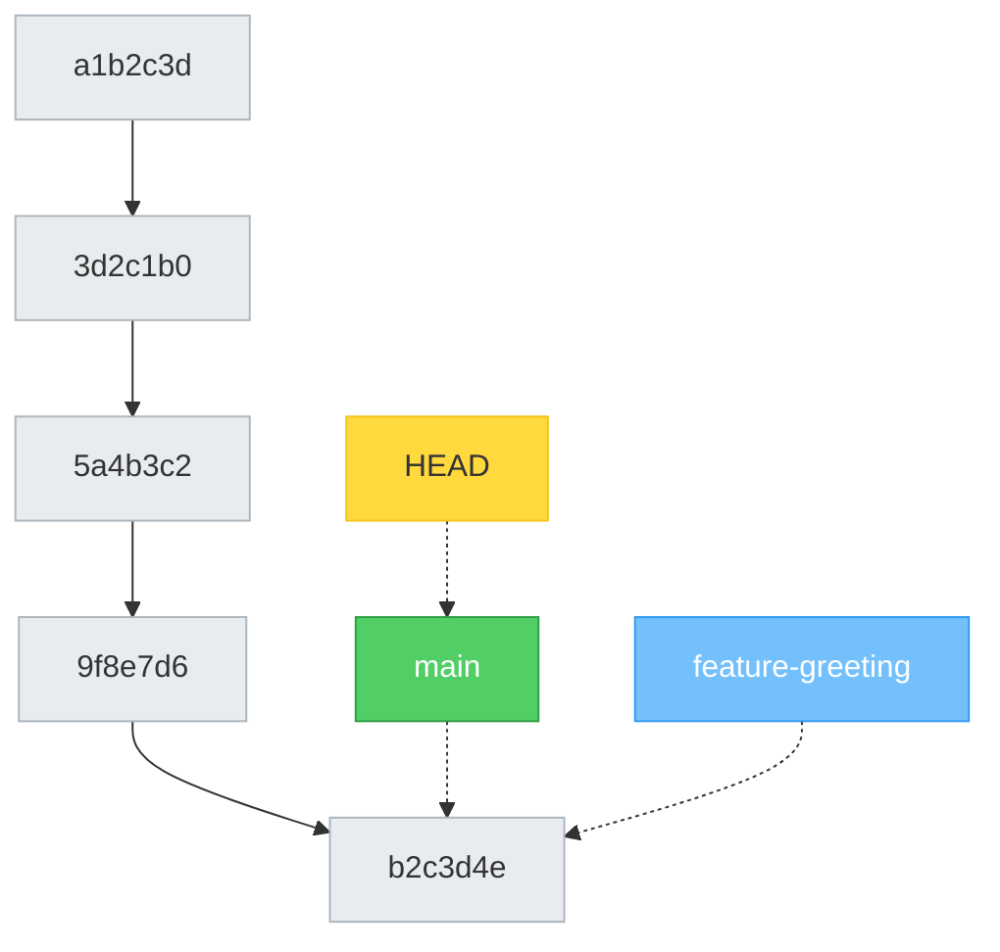
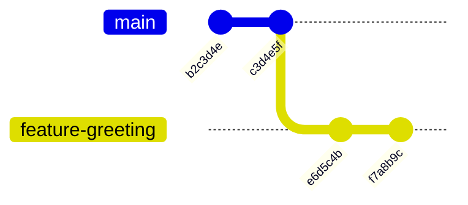

# Chapter 8: Parallel Universes! — Branching

[<< Previous: Undoing Things](07_undoing_things.md) | [Next: Merging >>](09_merging.md)

---

Okay, buckle up. This is the chapter where Git goes from "useful tool" to "actual superpower." 🦸

Imagine you could split reality into two parallel universes. In one universe, you keep working normally. In the other, you try something wild — a new feature, a crazy experiment, a complete redesign. If the experiment works, you merge it back into reality. If it fails, you throw that universe away and nobody ever knows.

That's **branching**. And in Git, it's practically free.

## What IS a Branch? 🌿

A branch is simply a **pointer to a commit**. That's it. It's not a copy of your files. It's not a separate folder. It's literally a tiny label (40 bytes!) that says "I'm pointing at this commit."

When you've been working so far, you've been on a branch called `main`. Every time you made a commit, the `main` pointer moved forward to the new commit:



That's one straight line — one timeline. One universe. Kinda boring, right? Let's create a parallel universe.

## Creating a Branch 🌱

```bash
cd ~/git-practice

# See what branches exist
git branch
```

```
* main
```

The `*` means "you are here." Right now, there's only `main`. Let's create a new branch:

```bash
git branch feature-greeting
```

No output? That's normal. Let's verify:

```bash
git branch
```

```
  feature-greeting
* main
```

Two branches! But notice the `*` is still on `main`. We created the branch but we're still on `main`. The new branch is just a sign post pointing at the same commit — we haven't moved there yet.



See? Both branches point at the same commit. HEAD points at `main`. Nothing has diverged yet.

## Switching Branches 🔀

To move to your new branch:

```bash
git switch feature-greeting
```

```
Switched to branch 'feature-greeting'
```

Or the shortcut to **create AND switch** in one command:

```bash
git switch -c my-new-branch    # create + switch
```

> **💡 What about `git checkout`?**
>
> Older tutorials use `git checkout <branch>` to switch branches. It still works! But `git switch` was created in Git 2.23 to be clearer — `checkout` was doing too many jobs. Use `git switch` for branches, `git restore` for files. Clean and simple.

Let's verify where we are:

```bash
git branch
```

```
* feature-greeting
  main
```

The `*` moved! We're now in the `feature-greeting` universe. 🌌

## Making Commits on a Branch 📝

Let's make some changes on this branch:

```bash
echo "Hello from the feature branch!" > greeting.txt
git add greeting.txt
git commit -m "Add greeting message"
```

```bash
echo "Welcome to our awesome project!" >> greeting.txt
git add greeting.txt
git commit -m "Add welcome message to greeting"
```

Now let's see what happened to our timeline:

```bash
git log --oneline --all --graph
```

```
* f7a8b9c (HEAD -> feature-greeting) Add welcome message to greeting
* e6d5c4b Add greeting message
* b2c3d4e (main) Add worldwide usage statistic to facts
* ...
```

See that? `feature-greeting` is **ahead** of `main` by 2 commits. `main` is still pointing at its old commit. Two universes, diverging!



## The Magic Moment: Switching Back ✨

Here's where it gets mind-blowing. Switch back to `main`:

```bash
git switch main
```

Now look at your files:

```bash
ls
```

```
about_me.txt  adventure.txt  facts.txt  notes.txt  shopping.txt  todo.txt
```

**WHERE DID `greeting.txt` GO?!** 😱

It's not deleted. It's safe and sound — on the `feature-greeting` branch. When you switch branches, Git **swaps the files in your working directory** to match the branch you switched to. `main` doesn't know about `greeting.txt` because it was created on a different branch.

Switch back to see it reappear:

```bash
git switch feature-greeting
ls
```

```
about_me.txt  adventure.txt  facts.txt  greeting.txt  notes.txt  shopping.txt  todo.txt
```

There it is! 🎉 It was in the parallel universe all along.

> **🧠 Brain Power**
>
> This is the key insight about branches: **switching branches changes the files on your disk**. Git swaps them in and out instantly. It's not making copies — it's rearranging the same folder to match the snapshot of whatever branch you're on.
>
> This is why Git branches are so fast and cheap — they're not duplicating your entire project. They're just pointers with different views of the same underlying data.

## The Create-and-Switch Shortcut ⚡

Since creating a branch and switching to it is so common, there's a one-liner:

```bash
# Instead of:
git branch my-feature
git switch my-feature

# Just do:
git switch -c my-feature
```

The `-c` flag means "create." You'll use this constantly.

> **💡 There are no dumb questions**
>
> **Q: "Does creating a branch copy all my files?"**
>
> A: Nope! A branch is just a 40-byte pointer. Creating one is instant, no matter how big your project is. Git shares the underlying data between branches and only tracks the *differences*.
>
> **Q: "Can I have lots of branches?"**
>
> A: Absolutely! It's common for teams to have dozens or even hundreds of branches. Each one is tiny. Git handles this effortlessly.
>
> **Q: "What if I have unsaved changes when I try to switch branches?"**
>
> A: Git will warn you! It won't let you switch if you have changes that would be overwritten. You'll need to either commit your changes, stash them (an advanced topic), or discard them first.
>
> **Q: "Can I delete a branch?"**
>
> A: Yes! `git branch -d branch-name` deletes a branch that has been merged. We'll cover this in the next chapter when we learn about merging.

## Naming Branches — Some Conventions 🏷️

Branches can be named almost anything, but here are common team conventions:

| Pattern | Example | When to Use |
|---------|---------|-------------|
| `feature/description` | `feature/user-login` | Adding something new |
| `fix/description` | `fix/broken-button` | Fixing a bug |
| `chore/description` | `chore/update-deps` | Maintenance work |
| `experiment/description` | `experiment/new-layout` | Trying something out |

Rules:
- ✅ Use lowercase and hyphens: `feature/add-search`
- ❌ No spaces: ~~`my cool branch`~~
- ❌ No special characters: ~~`feature/add@search!`~~
- ✅ Be descriptive: `fix/login-crash-on-empty-email`
- ❌ Be vague: ~~`my-branch`~~ or ~~`test`~~

---

## 🏋️ Exercise 7: The Parallel Universe Experiment

**Objective:** Create a branch, make commits on it, switch back to `main`, and observe files changing before your eyes.

**Steps:**

1. Navigate to your practice repo and make sure you're on `main`:
   ```bash
   cd ~/git-practice
   git switch main
   ```

2. Create and switch to a new branch:
   ```bash
   git switch -c experiment/wild-ideas
   ```

3. Verify you're on the new branch:
   ```bash
   git branch
   ```
   **Expected:** The `*` should be next to `experiment/wild-ideas`.

4. Create a new file and commit it:
   ```bash
   echo "What if we added a dinosaur to the project? 🦕" > wild_idea.txt
   git add wild_idea.txt
   git commit -m "Add wild idea about dinosaurs"
   ```

5. Create another file and commit:
   ```bash
   echo "What if the app played music when you open it? 🎵" > another_idea.txt
   git add another_idea.txt
   git commit -m "Add wild idea about music"
   ```

6. Check that both files exist:
   ```bash
   ls wild_idea.txt another_idea.txt
   ```
   **Expected:** Both files are there.

7. Now switch back to `main`:
   ```bash
   git switch main
   ```

8. Check for the files:
   ```bash
   ls wild_idea.txt another_idea.txt
   ```
   **Expected:**
   ```
   ls: wild_idea.txt: No such file or directory
   ls: another_idea.txt: No such file or directory
   ```

   **They're gone!** 😲 (Not really — they're safe on the `experiment/wild-ideas` branch.)

9. View the branch graph:
   ```bash
   git log --oneline --all --graph
   ```
   **Expected:** You should see the branches diverging — `main` and `experiment/wild-ideas` pointing at different commits.

10. Switch back to see them again:
    ```bash
    git switch experiment/wild-ideas
    ls wild_idea.txt another_idea.txt
    ```
    **Expected:** Both files are back! Magic! ✨

**🎯 What You Learned:**

Branches are parallel universes. Changes made on one branch don't affect another. When you switch branches, Git swaps the files in your working directory instantly. This is the foundation for working on multiple features simultaneously, experimenting safely, and collaborating with a team.

---

## 📝 Pop Quiz: Chapter 8

**1. What is a branch in Git, technically?**

<details>
<summary>Show answer</summary>

A branch is just a **lightweight pointer to a commit**. It's a 40-byte label that says "I'm pointing at this commit." Creating a branch doesn't copy any files — it just creates a new pointer.

</details>

**2. What's the difference between `git branch feature` and `git switch -c feature`?**

<details>
<summary>Show answer</summary>

- `git branch feature` **creates** the branch but keeps you on your current branch
- `git switch -c feature` **creates AND switches** to the new branch in one step

Most of the time, you want `git switch -c` because you almost always want to start working on the branch right after creating it.

</details>

**3. You have uncommitted changes and try to switch branches. What happens?**

<details>
<summary>Show answer</summary>

Git will **warn you** and refuse to switch if the uncommitted changes would conflict with the other branch's files. You'll need to either:
- **Commit** your changes first
- **Stash** them (saves them temporarily — advanced topic)
- **Discard** them with `git restore`

This safety check prevents you from accidentally losing work!

</details>

---

🏆 **Level 8 Complete!** You can create parallel universes and hop between them! You've seen files appear and disappear as you switch branches. This is the power of Git branching. But what good are parallel universes if you can never bring them back together? Next up — **merging!** 🤝

---

[<< Previous: Undoing Things](07_undoing_things.md) | [Next: Merging >>](09_merging.md)
