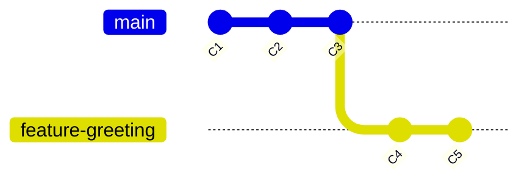
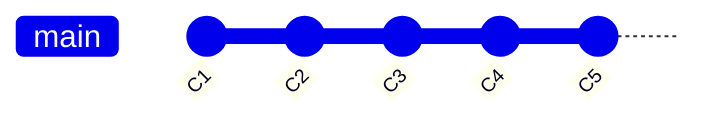
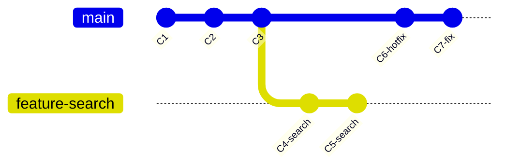
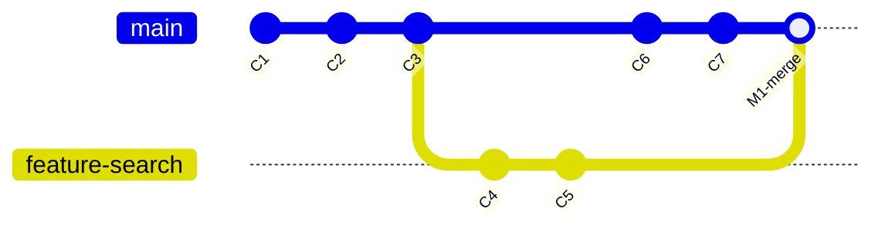
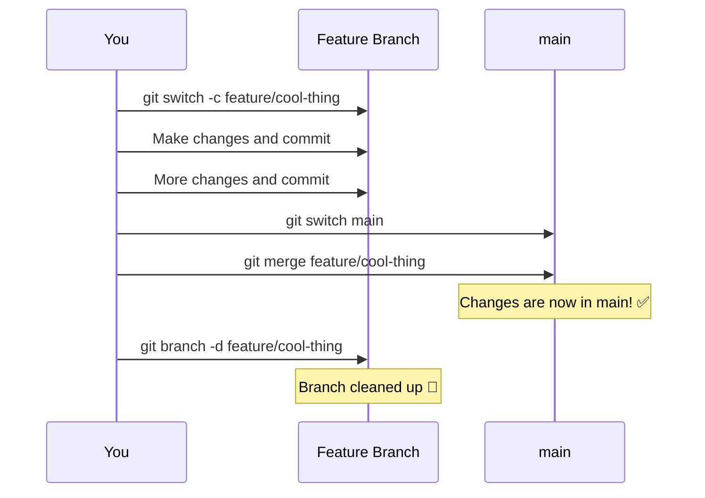

# Chapter 9: Bringing It All Together — Merging

[<< Previous: Branching](08_branching.md) | [Next: Merge Conflicts >>](10_merge_conflicts.md)

---

You've learned how to create parallel universes (branches). Now it's time for the really fun part — **smashing them back together.** 💥

Merging is how you take work from one branch and combine it into another. It's the moment your experiment becomes reality, your feature becomes part of the product, your wild idea becomes... well, slightly less wild.

## The Big Idea 🤝

Merging means: "Take the changes from branch X and apply them to my current branch."

The most common scenario: you've been working on a feature branch, and now you want to bring those changes into `main`.

```
You're on main. You say: "Hey Git, merge feature-greeting into me."
Git says: "Sure!" and combines the changes.
```

The command:

```bash
# Step 1: Switch to the branch you want to merge INTO
git switch main

# Step 2: Merge the other branch
git merge feature-greeting
```

That's it! But *how* Git merges depends on the situation. There are two scenarios.

## Scenario 1: Fast-Forward Merge ⏩

This is the simple case. It happens when the branch you're merging has commits that go *straight ahead* from where your current branch is — no divergence.

Let's say `main` hasn't changed since you created `feature-greeting`:

**Before merge:**



`main` is at C3. `feature-greeting` has C4 and C5 on top of C3. There's a straight line from `main` to `feature-greeting` — no fork in the road.

When you merge:

```bash
git switch main
git merge feature-greeting
```

```
Updating a1b2c3d..f7a8b9c
Fast-forward
 greeting.txt | 2 ++
 1 file changed, 2 insertions(+)
 create mode 100644 greeting.txt
```

See that? **"Fast-forward"**. Git just moved the `main` pointer forward to where `feature-greeting` already was. No new commit was created — Git simply fast-forwarded the tape.

**After merge:**



Now `main` and `feature-greeting` point at the same commit. Simple!

> **💡 Think of it like this:**
>
> Fast-forward is like catching up on a TV show. Your friend watched ahead (the feature branch). You haven't watched anything new (main didn't change). To "merge," you just watch the same episodes your friend already watched. No conflicts, no drama, no merging two different storylines — just catching up.

## Scenario 2: Three-Way Merge 🔀

This happens when **both branches have new commits** — they've diverged. This is more common in team settings where `main` keeps getting new commits from other people while you're working on your feature.

**Before merge:**



`main` has moved forward (C6, C7) while `feature-search` was also moving forward (C4, C5). The timelines have diverged!

When you merge:

```bash
git switch main
git merge feature-search
```

Git looks at three things (hence "three-way"):
1. The **common ancestor** (C3 — where the branches split)
2. The **tip of main** (C7)
3. The **tip of feature-search** (C5)

It figures out what changed on each side since C3, and combines them into a brand new **merge commit**:

**After merge:**



That merge commit (M1) has **two parents** — it ties the two timelines together. Your editor might pop open asking you to write a merge commit message. The default (`Merge branch 'feature-search'`) is usually fine.

> **🧠 Brain Power**
>
> Here's what's beautiful about a three-way merge: Git figures out the combination **automatically**. If you changed file A and your teammate changed file B, Git just takes both changes — no problem. It only asks for help when both sides changed the **same lines** in the **same file**. That's a merge conflict, and we'll tackle those in the next chapter.

## Let's Merge! — Hands-On 🛠️

Let's go through a real fast-forward merge. First, switch to `main`:

```bash
cd ~/git-practice
git switch main
```

Now merge the `feature-greeting` branch we created in Chapter 8:

```bash
git merge feature-greeting
```

You should see a fast-forward merge. Now verify:

```bash
# The greeting.txt file should be here now!
ls greeting.txt

# Check the log
git log --oneline --graph --all
```

`greeting.txt` is now part of `main`! The parallel universe has been absorbed into reality. 🌌→🌍

## Cleaning Up: Deleting Merged Branches 🧹

After merging a feature branch, it's good practice to delete it — keep things tidy:

```bash
git branch -d feature-greeting
```

```
Deleted branch feature-greeting (was f7a8b9c).
```

The `-d` flag means "delete, but only if it's been merged." This is a safety check — Git won't let you accidentally delete a branch with unmerged work.

> **⚠️ Watch it!**
>
> `git branch -d` = safe delete (only merged branches)
> `git branch -D` = force delete (even unmerged branches — use with caution!)
>
> Stick with lowercase `-d` until you're confident you want to throw away unmerged work.

After deleting:

```bash
git branch
```

```
* main
```

Clean! Just `main` again. But all the commits from `feature-greeting` are still in the history — the branch label is gone, but the commits live on.

## The Merge Workflow — Step by Step 📋

Here's the complete flow you'll follow again and again:



1. **Create** a feature branch
2. **Work** on it (commit, commit, commit)
3. **Switch** to `main`
4. **Merge** the feature branch into `main`
5. **Delete** the feature branch (cleanup)

This is the rhythm of Git. You'll do this hundreds of times. It becomes second nature.

> **💡 There are no dumb questions**
>
> **Q: "Do I always merge into `main`?"**
>
> A: Not necessarily! You can merge any branch into any other branch. But `main` is typically the "source of truth" — the branch that represents the current state of your project. Most feature branches get merged into `main`.
>
> **Q: "What if I merge and realize it was a mistake?"**
>
> A: You can revert a merge commit just like any other commit! `git revert <merge-commit-hash>` will undo the merge. Your safety net from Chapter 7 still works.
>
> **Q: "Can I merge `main` into my feature branch?"**
>
> A: Yes, and this is actually really common! If `main` has new changes from other team members, you might merge `main` into your feature branch to stay up to date. This helps catch conflicts early.

## Fast-Forward vs Three-Way — Quick Comparison

| | Fast-Forward ⏩ | Three-Way Merge 🔀 |
|---|---|---|
| **When?** | Target branch has NO new commits | Both branches have new commits |
| **New commit?** | No — just moves the pointer | Yes — creates a merge commit |
| **Complexity?** | Dead simple | More complex, but usually automatic |
| **Common?** | Personal projects, small teams | Teams, open source, busy repos |

---

## 🏋️ Exercise 8: The Reunion

**Objective:** Create a feature branch, make changes, merge it back into `main`, and clean up.

**Steps:**

1. Make sure you're on `main`:
   ```bash
   cd ~/git-practice
   git switch main
   ```

2. Create and switch to a new feature branch:
   ```bash
   git switch -c feature/add-hobbies
   ```

3. Create a new file and commit:
   ```bash
   echo "Hobbies:" > hobbies.txt
   echo "- Learning Git" >> hobbies.txt
   echo "- Reading" >> hobbies.txt
   echo "- Cooking" >> hobbies.txt
   git add hobbies.txt
   git commit -m "Add hobbies list"
   ```

4. Make another change and commit:
   ```bash
   echo "- Hiking" >> hobbies.txt
   git add hobbies.txt
   git commit -m "Add hiking to hobbies"
   ```

5. View the graph:
   ```bash
   git log --oneline --all --graph
   ```
   You should see `feature/add-hobbies` ahead of `main`.

6. Switch to `main`:
   ```bash
   git switch main
   ```

7. Verify `hobbies.txt` doesn't exist on `main`:
   ```bash
   ls hobbies.txt
   ```
   **Expected:** File not found (it's on the feature branch only).

8. Merge the feature branch:
   ```bash
   git merge feature/add-hobbies
   ```
   **Expected:** Fast-forward merge!

9. Verify the file is now on `main`:
   ```bash
   cat hobbies.txt
   ```
   **Expected:**
   ```
   Hobbies:
   - Learning Git
   - Reading
   - Cooking
   - Hiking
   ```

10. Clean up — delete the merged branch:
    ```bash
    git branch -d feature/add-hobbies
    ```

11. Verify it's gone:
    ```bash
    git branch
    ```
    **Expected:** Only `* main` remains.

12. Check the log — the commits are still there!
    ```bash
    git log --oneline -n 5
    ```

**🎯 What You Learned:**

You completed the full branch-merge-cleanup cycle! You created a feature branch, did isolated work, merged it into `main` (fast-forward), and deleted the branch. The commits survived the branch deletion — branches are just labels, and removing the label doesn't remove the history. This is the core workflow of Git collaboration.

---

## 📝 Pop Quiz: Chapter 9

**1. What's the difference between a fast-forward merge and a three-way merge?**

<details>
<summary>Show answer</summary>

- **Fast-forward:** The target branch (e.g., `main`) has NO new commits since the feature branch was created. Git just moves the pointer forward. No new commit is created.
- **Three-way merge:** Both branches have new commits — they've diverged. Git creates a new **merge commit** that combines both sets of changes.

</details>

**2. What command merges `feature/login` into `main`?**

<details>
<summary>Show answer</summary>

```bash
git switch main              # First, switch to the branch you're merging INTO
git merge feature/login      # Then merge the other branch
```

Always switch to the **destination** branch first, then merge the **source** branch into it.

</details>

**3. After merging, should you delete the feature branch? Does that delete the commits?**

<details>
<summary>Show answer</summary>

**Yes**, deleting the feature branch after merging is good practice — it keeps your branch list clean.

**No**, deleting a branch does NOT delete its commits! Branches are just labels. The commits are part of the history and will show up in `git log` forever. You're just removing the label, not the work.

</details>

---

🏆 **Level 9 Complete!** You can create branches, work on them, and merge them back together. But what happens when two branches change the **same line** in the **same file**? Git gets confused and asks for help. That's a merge conflict — and it's not as scary as it sounds. Let's face it head-on!

---

[<< Previous: Branching](08_branching.md) | [Next: Merge Conflicts >>](10_merge_conflicts.md)
