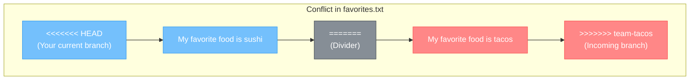
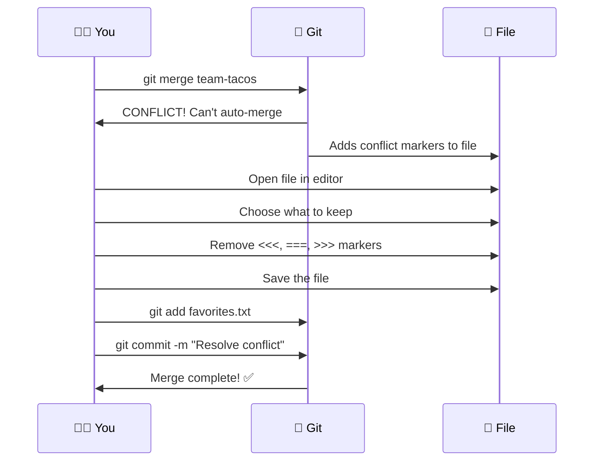

# Chapter 10: When Universes Collide — Merge Conflicts

[<< Previous: Merging](09_merging.md) | [Next: Working with Remotes >>](11_remotes.md)

---

Merge conflicts. The two words that make beginners break into a cold sweat. 😰

But here's a secret that experienced developers know: **merge conflicts are not scary. They're just Git asking you a question.**

Git is saying: *"Hey, two people (or two branches) changed the same part of the same file, and I can't figure out which version you want. Can you help me out?"*

That's it. It's a question, not an error. And by the end of this chapter, you'll answer it with confidence.

## Why Do Conflicts Happen? 🤔

Conflicts happen when:

1. Two branches modify the **same line(s)** in the **same file**
2. You try to merge them together
3. Git can't decide which version to keep

**Conflicts do NOT happen when:**
- Two branches modify **different files** (Git handles this automatically ✅)
- Two branches modify **different lines** in the same file (Git handles this too ✅)
- Only one branch modified a file (nothing to conflict with ✅)

So conflicts are actually pretty rare! But when they happen, you need to know what to do.

## Let's Create a Conflict On Purpose 💥

The best way to learn about conflicts is to make one yourself. Intentionally. Like a controlled explosion in a lab. 🧪

### Step 1: Set the Stage

```bash
cd ~/git-practice
git switch main
```

Create a file that we'll fight over:

```bash
echo "My favorite food is pizza" > favorites.txt
git add favorites.txt
git commit -m "Add favorites file with pizza"
```

### Step 2: Create Two Branches That Disagree

**Branch 1 — Team Sushi:**

```bash
git switch -c team-sushi
```

Edit the file to say sushi instead of pizza:

```bash
echo "My favorite food is sushi" > favorites.txt
git add favorites.txt
git commit -m "Change favorite food to sushi"
```

**Branch 2 — Team Tacos:**

Switch back to `main` first, then create the second branch:

```bash
git switch main
git switch -c team-tacos
```

Edit the file to say tacos:

```bash
echo "My favorite food is tacos" > favorites.txt
git add favorites.txt
git commit -m "Change favorite food to tacos"
```

### Step 3: The Collision 💥

Now let's merge. Switch to `main` and merge `team-sushi` first:

```bash
git switch main
git merge team-sushi
```

```
Updating a1b2c3d..b2c3d4e
Fast-forward
 favorites.txt | 2 +-
 1 file changed, 1 insertion(+), 1 deletion(-)
```

No problem! `team-sushi` merged cleanly (fast-forward). `favorites.txt` now says sushi.

Now try to merge `team-tacos`:

```bash
git merge team-tacos
```

```
Auto-merging favorites.txt
CONFLICT (content): Merge conflict in favorites.txt
Automatic merge failed; fix conflicts and then commit the result.
```

**THERE IT IS!** 🚨 A merge conflict!

Git is saying: *"favorites.txt was changed on both sides. The `main` branch (which now has sushi from the first merge) says one thing, and `team-tacos` says another. I don't know which one you want. Help!"*

## Anatomy of a Conflict 🔬

Let's look at what Git did to the file:

```bash
cat favorites.txt
```

```
<<<<<<< HEAD
My favorite food is sushi
=======
My favorite food is tacos
>>>>>>> team-tacos
```

Whoa. What are all those symbols?! Let's break it down:

```
<<<<<<< HEAD
```
This marks the **start** of the conflict. Everything between here and `=======` is what's on your **current branch** (HEAD = `main`, which now has sushi).

```
=======
```
This is the **divider**. Above it = your version. Below it = the incoming branch's version.

```
>>>>>>> team-tacos
```
This marks the **end** of the conflict. Everything between `=======` and here is from the branch you're trying to merge (`team-tacos`).

So the file is showing you both versions, side by side, and asking: **"Which one do you want?"**



## Resolving the Conflict ✅

Resolving a conflict is simple. You just:

1. **Open the file** in your text editor
2. **Decide** what the final version should be
3. **Remove** the conflict markers (`<<<<<<<`, `=======`, `>>>>>>>`)
4. **Save** the file
5. **Stage and commit**

### Option A: Keep Sushi
Edit `favorites.txt` to contain only:
```
My favorite food is sushi
```

### Option B: Keep Tacos
Edit `favorites.txt` to contain only:
```
My favorite food is tacos
```

### Option C: Keep Both (or Write Something New!)
Edit `favorites.txt` to contain:
```
My favorite foods are sushi and tacos
```

This is the beauty of conflict resolution — **you're in control**. You can pick either side, combine them, or write something completely different.

Let's go with Option C. Edit the file:

```bash
echo "My favorite foods are sushi and tacos" > favorites.txt
```

Verify the conflict markers are gone:

```bash
cat favorites.txt
```

```
My favorite foods are sushi and tacos
```

Clean! No more `<<<<<<<` or `>>>>>>>`. Now stage and commit:

```bash
git add favorites.txt
git commit -m "Resolve conflict: combine sushi and tacos"
```

```
[main 1a2b3c4] Resolve conflict: combine sushi and tacos
```

🎉 **Conflict resolved!** You're a diplomat now.

Check the status:

```bash
git status
```

```
nothing to commit, working tree clean
```

Peace has been restored. 🕊️

## The Conflict Resolution Flow 📋

Here's the complete process, step by step:



## Tips for Real-World Conflicts 🌍

In the real world, conflicts are usually more complex than our food example. Here are some tips:

### 1. Don't Panic 😤
A conflict is not an error. It's not broken. Git is just asking for help. Take a deep breath.

### 2. Read Both Versions Carefully 👀
Before deciding what to keep, understand what each side was trying to do. Maybe both changes are important and should be combined.

### 3. Use Your Editor's Conflict Tools 🛠️
VS Code and most modern editors highlight conflicts beautifully and give you buttons:
- **Accept Current Change** (keep HEAD version)
- **Accept Incoming Change** (keep the other branch's version)
- **Accept Both Changes** (keep everything)
- **Compare Changes** (see them side by side)

### 4. Test After Resolving ✅
After resolving, make sure the file actually makes sense. Don't just pick one side blindly — read the result!

### 5. Talk to Your Teammate 💬
If the conflict is in someone else's code, talk to them! Don't guess what they intended. A 2-minute conversation can prevent hours of debugging.

> **⚠️ Watch it!**
>
> **Never commit a file with conflict markers still in it!** If you see `<<<<<<<`, `=======`, or `>>>>>>>` in your code, the conflict is NOT resolved yet. These markers are literal text — they'll break your code if left in.
>
> Always search for `<<<<<<<` after resolving to make sure you got them all:
> ```bash
> grep -r "<<<<<<" .
> ```
> If that returns nothing, you're clean!

## Aborting a Merge — The Escape Hatch 🚪

Changed your mind? Don't want to deal with the conflict right now? You can abort the entire merge and go back to how things were:

```bash
git merge --abort
```

This resets everything to the state before you ran `git merge`. No harm done. You can always try again later.

> **💡 There are no dumb questions**
>
> **Q: "Can I prevent conflicts from happening?"**
>
> A: You can't completely prevent them, but you can reduce them:
> - **Merge frequently** — the longer your branch lives, the more likely conflicts become
> - **Keep branches short-lived** — merge back to `main` often (this is trunk-based development — Chapter 12!)
> - **Communicate with your team** — "Hey, I'm working on file X" prevents two people from editing the same thing
>
> **Q: "What if I resolve the conflict wrong?"**
>
> A: The merge created a commit. You can always `git revert` that commit and try again! Nothing in Git is permanent damage.
>
> **Q: "What if there are conflicts in MULTIPLE files?"**
>
> A: Same process — resolve each file one by one. `git status` will show you which files still have conflicts. Fix them all, stage them all, then commit once.

---

## 🏋️ Exercise 9: The Deliberate Collision

**Objective:** Intentionally create a merge conflict, understand the conflict markers, and resolve it.

**Steps:**

1. Start on `main`:
   ```bash
   cd ~/git-practice
   git switch main
   ```

2. Create a file for the exercise:
   ```bash
   echo "The best programming language is Python" > opinions.txt
   git add opinions.txt
   git commit -m "Add opinions file"
   ```

3. Create a branch and change the opinion:
   ```bash
   git switch -c opinion-javascript
   echo "The best programming language is JavaScript" > opinions.txt
   git add opinions.txt
   git commit -m "Change best language to JavaScript"
   ```

4. Go back to `main` and create a different opinion:
   ```bash
   git switch main
   git switch -c opinion-rust
   echo "The best programming language is Rust" > opinions.txt
   git add opinions.txt
   git commit -m "Change best language to Rust"
   ```

5. Merge the first opinion branch into `main`:
   ```bash
   git switch main
   git merge opinion-javascript
   ```
   This should succeed (fast-forward).

6. Now merge the conflicting branch:
   ```bash
   git merge opinion-rust
   ```
   **Expected:** CONFLICT!

7. Look at the conflicted file:
   ```bash
   cat opinions.txt
   ```
   You should see the conflict markers with JavaScript and Rust.

8. Resolve the conflict — pick your favorite, combine them, or write something new:
   ```bash
   echo "The best programming languages are JavaScript, Rust, and whatever makes you happy" > opinions.txt
   ```

9. Verify markers are gone:
   ```bash
   grep "<<<<<<" opinions.txt
   ```
   **Expected:** No output (no markers found).

10. Stage and commit:
    ```bash
    git add opinions.txt
    git commit -m "Resolve conflict: all languages are great"
    ```

11. Clean up the branches:
    ```bash
    git branch -d opinion-javascript
    git branch -d opinion-rust
    ```

12. View the merge in the log:
    ```bash
    git log --oneline --graph -n 6
    ```

**🎯 What You Learned:**

Merge conflicts aren't scary — they're just Git asking for your decision when two branches change the same thing. You can read the conflict markers, decide what the final version should be, remove the markers, and commit. You also learned you can abort a merge with `git merge --abort` if you need to bail out. Conflicts are a normal part of collaboration!

---

## 📝 Pop Quiz: Chapter 10

**1. When does a merge conflict happen?**

<details>
<summary>Show answer</summary>

A merge conflict happens when two branches change the **same lines** in the **same file**. Git can automatically merge changes to different files or different parts of the same file — conflicts only occur when it can't decide between two competing changes to the exact same spot.

</details>

**2. What do the symbols `<<<<<<<`, `=======`, and `>>>>>>>` mean in a conflicted file?**

<details>
<summary>Show answer</summary>

- `<<<<<<< HEAD` — Start of conflict. Below this is YOUR branch's version (current branch).
- `=======` — Divider between the two versions.
- `>>>>>>> branch-name` — End of conflict. Above this (after the divider) is the INCOMING branch's version.

To resolve: delete these markers, keep the content you want, save, stage, and commit.

</details>

**3. You start resolving a conflict but realize you don't understand the code enough. How do you bail out?**

<details>
<summary>Show answer</summary>

```bash
git merge --abort
```

This cancels the merge entirely and returns your repo to the state before you ran `git merge`. No changes are lost — you can try again later after talking to your teammate or understanding the code better.

</details>

---

🏆 **Level 10 Complete!** You've stared merge conflicts in the face and won! You can read conflict markers, resolve them confidently, and even abort if you need to. Conflicts are no longer mysterious — they're just a conversation with Git. Next up: taking your repo online with **remotes and GitHub!** ☁️

---

[<< Previous: Merging](09_merging.md) | [Next: Working with Remotes >>](11_remotes.md)
