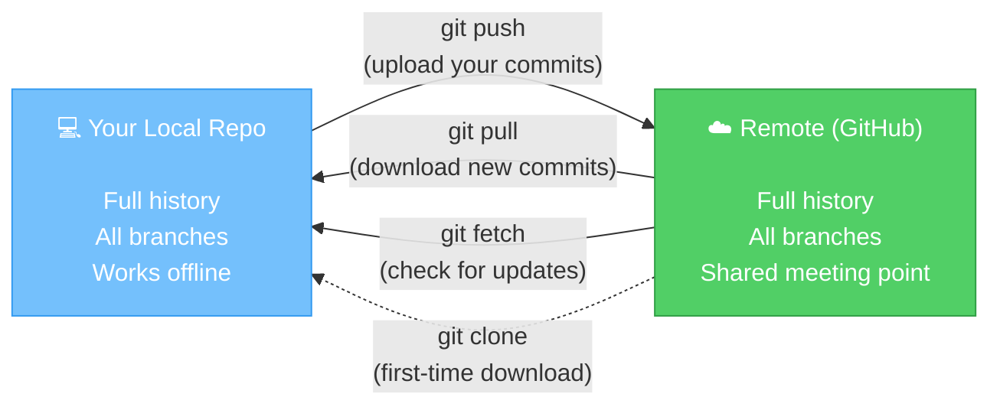
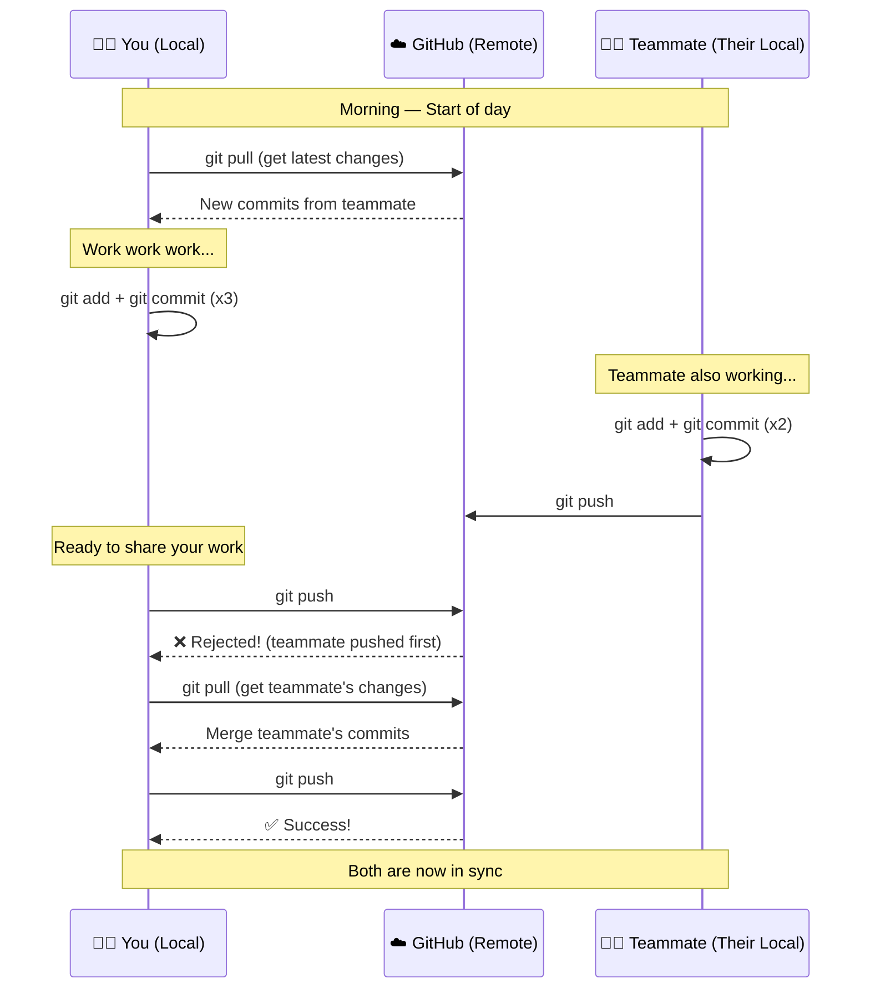

# Chapter 11: Going Online! — Working with Remotes

[<< Previous: Merge Conflicts](10_merge_conflicts.md) | [Next: Trunk-Based Development >>](12_trunk_based_development.md)

---

So far, everything you've done has been **local** — on your own machine, in your own little universe. That's great for learning, but Git's real superpower kicks in when you connect to the internet and start collaborating.

In this chapter, you'll learn how to put your code on **GitHub**, share it with the world (or just your team), and keep everything in sync. Let's go online! 🌐

## What Is a Remote? 🌍

A **remote** is a copy of your repository that lives on another computer — usually a server on the internet. Think of it as a **backup + meeting point** for your team.

The most popular place to host remotes is **GitHub**, but there are others (GitLab, Bitbucket, etc.). They all work the same way with Git.

> **💡 Key insight:**
>
> Remember from Chapter 2 — Git is **distributed**. Your local repo is a complete, fully functional copy. The remote is *also* a complete copy. Neither one is "the boss." But by convention, teams treat the remote on GitHub as the **shared source of truth** — the place everyone syncs up.



## The Four Key Commands 🔑

| Command | What It Does | Direction |
|---------|-------------|-----------|
| `git clone <url>` | Download a remote repo for the first time | Remote → Local |
| `git push` | Upload your new commits to the remote | Local → Remote |
| `git pull` | Download new commits from the remote AND merge them | Remote → Local |
| `git fetch` | Download new commits but DON'T merge (just check) | Remote → Local |

Let's learn each one.

## `git clone` — "Give Me a Copy!" 📥

`git clone` is how you download a repository that already exists on GitHub. It creates a new folder on your machine with the complete project and all its history.

```bash
git clone https://github.com/someone/their-project.git
```

This creates a folder called `their-project/` with everything inside. You're ready to work immediately.

> **💡 You only clone ONCE.** After that, you use `push` and `pull` to stay in sync. Cloning again would create a duplicate.

When you clone, Git automatically:
- Downloads the entire repo with all history
- Sets up the remote connection (named `origin` by default)
- Creates a local `main` branch that tracks the remote `main`

## Connecting Your Local Repo to GitHub 🔗

If you already have a local repo (like our `git-practice`!) and want to put it on GitHub, the process is:

### Step 1: Create a Repo on GitHub

1. Go to [github.com](https://github.com) and sign in (create an account if you don't have one)
2. Click the **+** button (top right) → **New repository**
3. Name it `git-practice`
4. **Don't** initialize with a README (you already have files locally)
5. Click **Create repository**

GitHub will show you some commands. We need the "push an existing repository" ones.

### Step 2: Add the Remote

Back in your terminal:

```bash
cd ~/git-practice

# Add GitHub as a remote called "origin"
git remote add origin https://github.com/YOUR-USERNAME/git-practice.git
```

`origin` is just a nickname for the remote URL. It's the convention — almost everyone calls their main remote `origin`.

Verify it worked:

```bash
git remote -v
```

```
origin  https://github.com/YOUR-USERNAME/git-practice.git (fetch)
origin  https://github.com/YOUR-USERNAME/git-practice.git (push)
```

Two lines — one for fetching (downloading) and one for pushing (uploading). They're usually the same URL.

### Step 3: Push! 🚀

```bash
git push -u origin main
```

Let's decode this:
- `git push` — upload commits
- `-u` — set up tracking (so future pushes just need `git push`)
- `origin` — push to the remote called "origin"
- `main` — push the `main` branch

```
Enumerating objects: 25, done.
Counting objects: 100% (25/25), done.
Delta compression using up to 8 threads
Compressing objects: 100% (20/20), done.
Writing objects: 100% (25/25), 2.15 KiB | 1.07 MiB/s, done.
Total 25 (delta 5), reused 0 (delta 0)
To https://github.com/YOUR-USERNAME/git-practice.git
 * [new branch]      main -> main
Branch 'main' set up to track remote branch 'main' from 'origin'.
```

🎉 **Your code is on GitHub!** Go to `https://github.com/YOUR-USERNAME/git-practice` and you'll see all your files and commit history. Beautiful!

> **💡 The `-u` flag is a one-time thing.** After the first push with `-u`, you can just run `git push` for future pushes. Git remembers where to send it.

## `git push` — Upload Your Work ⬆️

After the initial setup, the daily workflow is simple. Make commits locally, then push:

```bash
# Make a change
echo "This was added after going online!" >> adventure.txt
git add adventure.txt
git commit -m "Update adventure file after connecting to GitHub"

# Push to GitHub
git push
```

```
To https://github.com/YOUR-USERNAME/git-practice.git
   a1b2c3d..b2c3d4e  main -> main
```

That's it! Your new commit is now on GitHub for everyone to see.

## `git pull` — Download New Stuff ⬇️

`git pull` downloads new commits from the remote and merges them into your current branch. You use this when:
- A teammate pushed new commits
- You made changes on GitHub's web interface
- You're working on multiple computers

```bash
git pull
```

```
remote: Enumerating objects: 5, done.
remote: Counting objects: 100% (5/5), done.
Unpacking objects: 100% (3/3), done.
From https://github.com/YOUR-USERNAME/git-practice
   b2c3d4e..c3d4e5f  main     -> origin/main
Updating b2c3d4e..c3d4e5f
Fast-forward
 README.md | 3 +++
 1 file changed, 3 insertions(+)
```

Git downloaded the new commits and merged them in. Easy!

> **⚠️ Watch it!**
>
> **Always pull before you push.** If someone else pushed commits while you were working, your push will be rejected:
> ```
> ! [rejected]        main -> main (fetch first)
> error: failed to push some refs to 'origin'
> hint: Updates were rejected because the remote contains work that you do not have locally.
> ```
> The fix? `git pull` first, then `git push`. Git needs you to be up-to-date before uploading.

## `git fetch` — Check Without Committing 🔍

`git fetch` downloads new data from the remote but **doesn't merge** anything. It just updates your knowledge of what's on the remote.

```bash
git fetch
```

This is like checking your mailbox without opening the letters. You know new mail arrived, but you haven't read it yet.

After fetching, you can:
- See what changed: `git log origin/main --oneline`
- Compare: `git diff main origin/main`
- Then merge when ready: `git merge origin/main`

> **💡 `git pull` = `git fetch` + `git merge`**
>
> Pull is just a shortcut that does both steps at once. Some developers prefer to fetch first (to review changes) and then merge manually. Both approaches work!

## The Push-Pull Dance — Visualized 💃🕺

Here's what a typical day looks like when collaborating:



The golden rule: **pull, then push. Always.**

## Understanding `origin/main` 🏷️

After connecting to a remote, you'll notice something new in `git log`:

```bash
git log --oneline --all
```

```
b2c3d4e (HEAD -> main, origin/main) Update adventure file
a1b2c3d Add initial project files
```

See `origin/main`? That's a **remote-tracking branch** — Git's local memory of where `main` is on the remote. It updates every time you push, pull, or fetch.

| Branch | What It Is |
|--------|-----------|
| `main` | YOUR local branch — moves when you commit |
| `origin/main` | Git's memory of where `main` is on GitHub — moves when you push/pull/fetch |

If `main` is ahead of `origin/main`, you have commits that haven't been pushed yet:
```
b2c3d4e (HEAD -> main) Your new commit
a1b2c3d (origin/main) Last pushed commit
```

## `git remote` — Managing Remotes 🔧

Some useful commands for working with remotes:

| Command | What It Does |
|---------|-------------|
| `git remote -v` | Show all remotes and their URLs |
| `git remote add <name> <url>` | Add a new remote |
| `git remote remove <name>` | Remove a remote |
| `git remote rename <old> <new>` | Rename a remote |

Most of the time you'll only have one remote (`origin`), but advanced workflows might have more.

> **💡 There are no dumb questions**
>
> **Q: "What's the difference between HTTPS and SSH URLs?"**
>
> A: Two ways to authenticate with GitHub:
> - **HTTPS** (`https://github.com/...`) — uses your username + password (or a personal access token). Simpler to set up.
> - **SSH** (`git@github.com:...`) — uses SSH keys. No password needed after setup. More convenient long-term.
>
> Both work equally well. If you're just starting, HTTPS is fine. You can switch to SSH later.
>
> **Q: "Can I push to a branch that doesn't exist on the remote yet?"**
>
> A: Yes! `git push -u origin my-new-branch` will create the branch on GitHub and push to it. The `-u` sets up tracking so future pushes are just `git push`.
>
> **Q: "What if I don't want to use GitHub?"**
>
> A: You don't have to! Git works with any remote — GitLab, Bitbucket, your own server, or even a USB drive. GitHub is just the most popular option.

---

## 🏋️ Exercise 10: Going Live!

**Objective:** Connect your local repo to GitHub, push your commits, clone it to a second folder, and verify everything synced.

**Steps:**

### Part A: Push to GitHub

1. Go to [github.com](https://github.com) → **New repository**
   - Name: `git-practice`
   - Leave it empty (no README, no .gitignore)
   - Click **Create repository**

2. In your terminal, add the remote:
   ```bash
   cd ~/git-practice
   git remote add origin https://github.com/YOUR-USERNAME/git-practice.git
   ```

3. Verify:
   ```bash
   git remote -v
   ```
   **Expected:** Two lines showing your GitHub URL.

4. Push everything:
   ```bash
   git push -u origin main
   ```

5. Go to `https://github.com/YOUR-USERNAME/git-practice` in your browser. 
   
   **Expected:** All your files and commit history are there! 🎉

### Part B: Clone to a Second Folder

6. Clone the repo to a different location (simulating being on a different computer):
   ```bash
   git clone https://github.com/YOUR-USERNAME/git-practice.git ~/git-practice-clone
   ```

7. Navigate to the clone:
   ```bash
   cd ~/git-practice-clone
   ```

8. Verify the files are there:
   ```bash
   ls
   ```
   **Expected:** All the same files from your original repo.

9. Check the log:
   ```bash
   git log --oneline
   ```
   **Expected:** The complete commit history — identical to your original repo.

### Part C: The Sync Dance

10. Make a change in the **clone** and push it:
    ```bash
    echo "This change came from the clone!" > from_clone.txt
    git add from_clone.txt
    git commit -m "Add file from cloned repo"
    git push
    ```

11. Go back to the **original** repo and pull:
    ```bash
    cd ~/git-practice
    git pull
    ```

12. Verify the new file is there:
    ```bash
    cat from_clone.txt
    ```
    **Expected:**
    ```
    This change came from the clone!
    ```

**🎯 What You Learned:**

You connected a local repo to GitHub, pushed your entire history online, cloned it to a second location, and synced changes between them using push and pull. This is exactly how real-world collaboration works — the same repo, shared via a remote, kept in sync with push and pull. You're no longer coding alone!

---

## 📝 Pop Quiz: Chapter 11

**1. What's the difference between `git fetch` and `git pull`?**

<details>
<summary>Show answer</summary>

- `git fetch` downloads new data from the remote but **does NOT merge** it into your working branch. It just updates your remote-tracking branches (e.g., `origin/main`).
- `git pull` does `git fetch` + `git merge` in one step — it downloads AND integrates the changes.

Think of `fetch` as checking your mailbox, and `pull` as checking your mailbox AND reading all the letters.

</details>

**2. What does `origin` mean?**

<details>
<summary>Show answer</summary>

`origin` is the **default name** for your remote repository. It's just a nickname for the URL (like `https://github.com/you/project.git`). You can name it anything, but `origin` is the universal convention for the primary remote.

</details>

**3. Your push is rejected with "Updates were rejected." What should you do?**

<details>
<summary>Show answer</summary>

Run `git pull` first to download and merge the new commits from the remote, then `git push` again. The remote had commits you didn't have locally — Git needs you to be up-to-date before it lets you push.

**Golden rule:** Always pull before you push!

</details>

---

🏆 **Level 11 Complete!** You've gone online! Your code lives on GitHub, you can push and pull, and you've synced between two locations. You're now equipped for real collaboration. Next up — the workflow that ties everything together and keeps teams sane: **Trunk-Based Development!** 🌳

---

[<< Previous: Merge Conflicts](10_merge_conflicts.md) | [Next: Trunk-Based Development >>](12_trunk_based_development.md)
