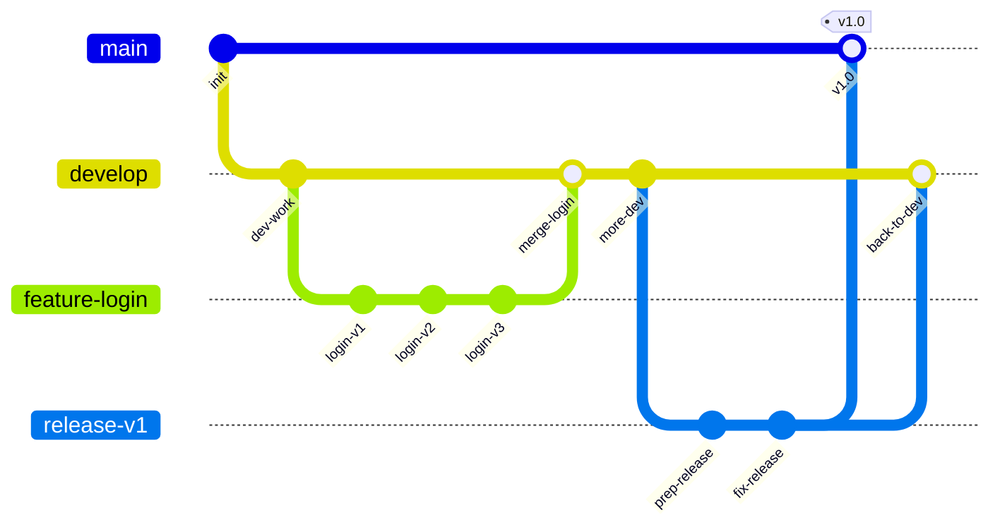
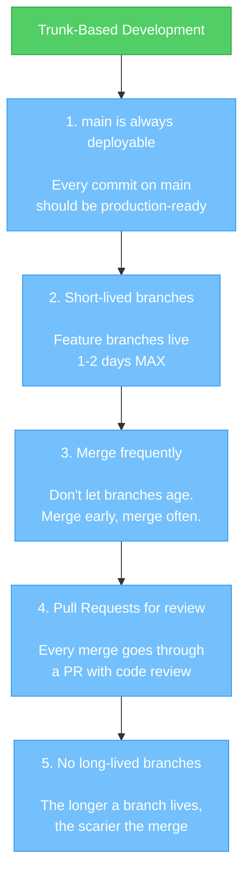
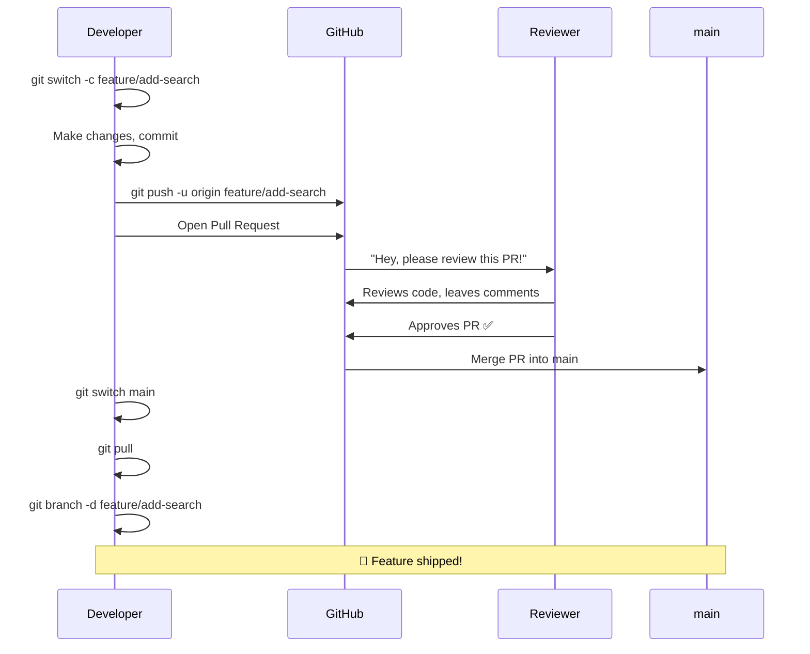
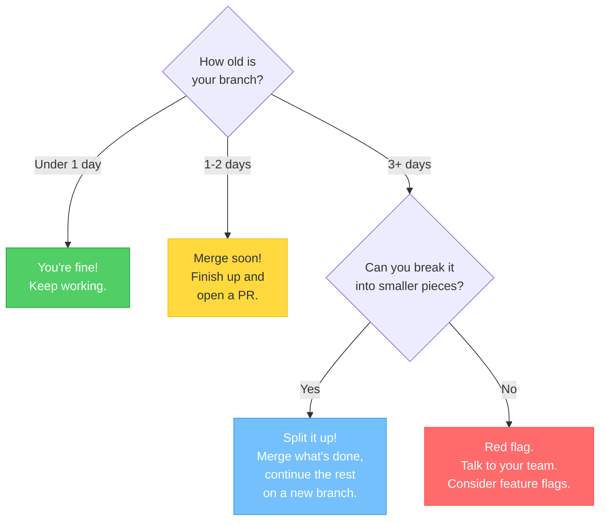

# Chapter 12: The Way of the Trunk — Trunk-Based Development

[<< Previous: Working with Remotes](11_remotes.md) | [Next: .gitignore >>](13_gitignore.md)

---

You now know all the Git mechanics — commits, branches, merges, remotes, conflicts. You've got the tools. But here's the thing: **knowing the tools isn't enough.** You also need a *strategy* for using them.

Imagine a kitchen full of chefs. They all know how to cook. But if they don't agree on who's making what, when to use the stove, and how to share the counter space — it's chaos. Pots flying. Sauce on the ceiling. Gordon Ramsay yelling.

A **workflow** is the team agreement that prevents the chaos. And the best one for most teams is called **Trunk-Based Development**.

## What Is a Workflow? 🗺️

A Git workflow is a set of rules a team follows for:
- How to use branches
- When to merge
- How to review code
- How to release software

There are several popular workflows. Let's briefly meet the lineup, then zoom into the star of the show.

## The Workflow Lineup 🎭

### GitFlow — The Complicated One

GitFlow uses **many long-lived branches**: `main`, `develop`, `feature/*`, `release/*`, `hotfix/*`. There are strict rules about what merges into what.



Look at that diagram. 😵 Multiple long-lived branches, complex merge paths, release branches... it works, but it's heavy. GitFlow was designed for a world where software shipped on CDs every few months. Most modern teams have moved on.

### GitHub Flow — The Simpler One

Feature branches off `main`, pull requests for review, merge back to `main`. No `develop` branch, no release branches. Much simpler!

### Trunk-Based Development — The Simplest & Most Modern 🌟

One main branch (the "trunk"). Very short-lived feature branches. Merge back constantly. Keep `main` always deployable.

**This is what most high-performing teams use.** Let's dive deep.

## 🎭 Fireside Chat: GitFlow vs Trunk-Based Development

> *GitFlow and Trunk-Based Development sat down for coffee. Things got spicy.*
>
> **GitFlow:** "I have structure! Discipline! Five types of branches, each with a purpose!"
>
> **Trunk-Based:** "You have complexity. I have simplicity. One branch to rule them all."
>
> **GitFlow:** "But how do you handle releases? I have release branches!"
>
> **Trunk-Based:** "I deploy from `main` multiple times a day. Every commit is releasable."
>
> **GitFlow:** "Multiple times a DAY?! How do you handle unfinished features?"
>
> **Trunk-Based:** "Feature flags. I can merge code that's not visible to users yet. When it's ready, flip the flag."
>
> **GitFlow:** "But my `develop` branch—"
>
> **Trunk-Based:** "—is a merge nightmare waiting to happen. How long do your feature branches live?"
>
> **GitFlow:** "Sometimes... weeks? Months?"
>
> **Trunk-Based:** "There's your problem. My branches live 1-2 days max. Merge conflicts barely exist."
>
> **GitFlow:** *looks at 47-file merge conflict* "...I see your point." 😬
>
> **Trunk-Based:** "Merge early, merge often. That's the way."

## Trunk-Based Development — The Deep Dive 🌳

### The Philosophy

One sentence: **`main` is always deployable.**

That's it. That's the whole philosophy. Everything else flows from this one rule. If `main` is always in a good state, you can deploy anytime, anyone can start a new branch from `main` knowing it works, and you never have that terrifying "let's merge the big branch and pray" moment.

### The Core Rules



Let's unpack each one.

### Rule 1: `main` Is Always Deployable 🟢

This is sacred. If someone looks at `main`, it should work. That means:
- No broken code on `main`
- No half-finished features on `main` (use feature flags instead)
- Automated tests pass before merging
- Code review happens before merging

### Rule 2: Short-Lived Branches 🦋

Branches are **mayflies, not tortoises**. Create a branch, do a small piece of work, merge it back. Ideally within a day or two.

Why? Because the longer a branch lives, the more `main` changes underneath it, and the more likely you'll face a painful merge conflict.

| Branch Lifespan | Pain Level |
|----------------|------------|
| Hours | 😊 Smooth sailing |
| 1-2 days | 🙂 Usually fine |
| 1 week | 😬 Getting risky |
| 2+ weeks | 😱 Merge conflict nightmare |
| 1+ month | 💀 Abandon all hope |

### Rule 3: Merge Frequently 🔄

"Merge early, merge often." Don't wait until your feature is "perfect." Merge small increments:

- ✅ Day 1: Merge the database schema change
- ✅ Day 2: Merge the API endpoint
- ✅ Day 3: Merge the UI component
- ❌ Day 30: Merge everything at once in a 200-file pull request

Small merges = small risk = happy team.

### Rule 4: Pull Requests for Review 👀

A **Pull Request** (PR) is a request to merge your branch into `main`. Before it merges, your teammates review the code. This catches bugs, shares knowledge, and keeps code quality high.

The PR workflow:



### Rule 5: No Long-Lived Branches 🚫

In trunk-based development, the ONLY long-lived branch is `main`. Everything else is temporary:

- ✅ `feature/add-search` (lives 1 day, then deleted)
- ✅ `fix/login-crash` (lives 2 hours, then deleted)
- ❌ `develop` (lives forever — that's GitFlow, not trunk-based)
- ❌ `staging` (lives forever — nope!)

### What About Unfinished Features? 🚧

"But what if my feature takes 2 weeks? I can't merge half-built stuff into `main`!"

Great question! The answer is **feature flags** — a way to merge code that's hidden from users until it's ready:

```python
# The code is merged into main, but nobody sees it yet
if feature_flags.is_enabled("new_search"):
    show_new_search_bar()
else:
    show_old_search_bar()
```

The code is in `main`, but the feature flag is off. When the feature is complete and tested, flip the flag to on. This lets you:
- Merge small pieces daily
- Avoid long-lived branches
- Test the feature internally before users see it
- Roll back instantly if something goes wrong (just flip the flag off)

> **💡 Feature flags are a whole topic on their own.** For now, just know they exist and why they matter. They're the secret weapon that makes trunk-based development work for big features.

## How Trunk-Based Prevents "Merge Hell" 🔥

Let's compare two scenarios:

### Scenario A: Long-Lived Branch (3 weeks)
```
Week 1: You branch from main. You code. Main gets 15 new commits from teammates.
Week 2: You code more. Main gets 20 more commits. You don't pull.
Week 3: You try to merge. 47 files have conflicts. You spend 2 days resolving them.
         Some of your fixes break other people's code. Everyone is unhappy. 😤
```

### Scenario B: Trunk-Based (daily merges)
```
Day 1: Branch from main. Small change. Merge back. 0 conflicts.
Day 2: Branch from main. Small change. Merge back. 0 conflicts.
Day 3: Branch from main. Small change. 1 tiny conflict, fixed in 30 seconds.
        Everything is always up to date. Nobody is unhappy. 😊
```

The math is simple: **frequent small merges beat rare big merges. Every time.**

## The Decision Tree: "Is My Branch Too Old?" 🌲



## When to Use Trunk-Based Development 🤔

| Scenario | Use Trunk-Based? |
|----------|-----------------|
| Most software teams | ✅ Yes — it's the modern default |
| Open source projects | ✅ Yes — with PRs for review |
| Solo projects | ✅ Yes — good habits start early |
| Releasing on a fixed schedule (e.g., every 6 months) | 🤷 Maybe GitFlow fits better |
| Teams with no CI/CD or automated tests | ⚠️ Risky without safety nets |

Most teams at top tech companies (Google, Meta, Amazon, Netflix) use some form of trunk-based development. It's battle-tested at massive scale.

> **🧠 Brain Power**
>
> Think about a team where everyone creates long-lived branches and merges once a month. What problems would they run into?
>
> Now think about the same team using trunk-based development — short branches, daily merges, code review via PRs. How would the experience be different?
>
> The core insight: **integration pain doesn't go away if you delay it. It just grows.**

---

## 🏋️ Exercise 11: The Trunk-Based Drill

**Objective:** Simulate the trunk-based development workflow 3 times to build muscle memory.

**Steps:**

### Round 1: Feature Branch → PR → Merge

1. Start on `main` and make sure it's up to date:
   ```bash
   cd ~/git-practice
   git switch main
   git pull  # if you have a remote set up
   ```

2. Create a short-lived feature branch:
   ```bash
   git switch -c feature/add-quote
   ```

3. Make a small change and commit:
   ```bash
   echo '"The best time to plant a tree was 20 years ago. The second best time is now." — Proverb' > quote.txt
   git add quote.txt
   git commit -m "Add inspirational quote"
   ```

4. Push and create a PR (if you have GitHub set up):
   ```bash
   git push -u origin feature/add-quote
   ```
   Then go to GitHub and click **"Compare & pull request"** → **"Create pull request"** → **"Merge pull request"** → **"Delete branch"**.

   *If you don't have GitHub set up, merge locally:*
   ```bash
   git switch main
   git merge feature/add-quote
   git branch -d feature/add-quote
   ```

5. Update your local `main`:
   ```bash
   git switch main
   git pull  # if using GitHub
   ```

### Round 2: Another Feature

6. Create another branch:
   ```bash
   git switch -c feature/add-motto
   ```

7. Make a change:
   ```bash
   echo "Our motto: Ship small, ship often!" > motto.txt
   git add motto.txt
   git commit -m "Add team motto"
   ```

8. Merge back (via PR or locally):
   ```bash
   git switch main
   git merge feature/add-motto
   git branch -d feature/add-motto
   ```

### Round 3: A Bug Fix

9. Create a fix branch:
   ```bash
   git switch -c fix/typo-in-quote
   ```

10. Fix something:
    ```bash
    echo '"The best time to plant a tree was 20 years ago. The second best time is now." - Chinese Proverb' > quote.txt
    git add quote.txt
    git commit -m "Fix attribution in quote"
    ```

11. Merge back:
    ```bash
    git switch main
    git merge fix/typo-in-quote
    git branch -d fix/typo-in-quote
    ```

12. Verify no stale branches remain:
    ```bash
    git branch
    ```
    **Expected:** Only `* main`.

13. View the history:
    ```bash
    git log --oneline -n 6
    ```

**🎯 What You Learned:**

You practiced the trunk-based rhythm: **branch → commit → merge → delete → repeat.** Notice how each branch lived for only a minute or two and had exactly 1 commit. That's the ideal! In real life, a branch might have 2-5 commits and live for a day, but the principle is the same: keep it small, keep it short, keep merging.

---

## 🏋️ Exercise 12: Two Developers, One Repo

**Objective:** Simulate two developers collaborating via trunk-based development.

*You'll need your GitHub repo from Exercise 10 for this. You'll use your original repo (`~/git-practice`) as Developer A and the clone (`~/git-practice-clone`) as Developer B.*

**Steps:**

### Developer A works:

1. Navigate to the original repo:
   ```bash
   cd ~/git-practice
   git switch main
   git pull
   ```

2. Create a feature branch, make a change, and push:
   ```bash
   git switch -c feature/dev-a-greeting
   echo "Developer A says hello!" > dev_a.txt
   git add dev_a.txt
   git commit -m "Add Developer A greeting"
   git push -u origin feature/dev-a-greeting
   ```

3. Merge locally (simulating a merged PR):
   ```bash
   git switch main
   git merge feature/dev-a-greeting
   git push
   git branch -d feature/dev-a-greeting
   git push origin --delete feature/dev-a-greeting
   ```

### Developer B works:

4. Navigate to the clone:
   ```bash
   cd ~/git-practice-clone
   git switch main
   git pull
   ```
   **Expected:** Developer B now has `dev_a.txt`!

5. Developer B creates their own feature:
   ```bash
   git switch -c feature/dev-b-greeting
   echo "Developer B says hi!" > dev_b.txt
   git add dev_b.txt
   git commit -m "Add Developer B greeting"
   git push -u origin feature/dev-b-greeting
   ```

6. Merge and push:
   ```bash
   git switch main
   git merge feature/dev-b-greeting
   git push
   git branch -d feature/dev-b-greeting
   git push origin --delete feature/dev-b-greeting
   ```

### Developer A syncs:

7. Back to the original:
   ```bash
   cd ~/git-practice
   git pull
   ls dev_a.txt dev_b.txt
   ```
   **Expected:** Both files exist! Both developers' work is merged. 🎉

**🎯 What You Learned:**

This is real-world collaboration! Two developers, each on their own machine, creating short-lived branches, merging to `main`, and staying in sync with push and pull. No merge conflicts because they worked on different files. This is trunk-based development in action — simple, clean, and effective.

---

## 📝 Pop Quiz: Chapter 12

**1. What is the #1 rule of trunk-based development?**

<details>
<summary>Show answer</summary>

**`main` is always deployable.** Every commit on `main` should be production-ready. This is the foundation that everything else builds on — short-lived branches, frequent merges, and code review all serve to protect this rule.

</details>

**2. Why are short-lived branches better than long-lived branches?**

<details>
<summary>Show answer</summary>

Short-lived branches minimize **merge conflicts**. The longer a branch lives, the more `main` changes underneath it, and the bigger the gap between your branch and `main` becomes. Small, frequent merges are always easier and less risky than one massive merge after weeks of divergence.

</details>

**3. How do you handle a feature that takes 3 weeks to build in trunk-based development?**

<details>
<summary>Show answer</summary>

Break the work into small, mergeable pieces and merge each piece daily. Use **feature flags** to hide unfinished functionality from users — the code is in `main` but the feature is switched off until it's ready. This way, you get the benefits of frequent integration without exposing incomplete features.

</details>

---

🏆 **Level 12 Complete!** You've learned the most important workflow in modern software development. Trunk-based development keeps teams fast, keeps merges small, and keeps `main` always ready to ship. You now understand not just *how* to use Git, but *how teams use Git together*. Almost there — just two more chapters! 🏃‍♂️

---

[<< Previous: Working with Remotes](11_remotes.md) | [Next: .gitignore >>](13_gitignore.md)
