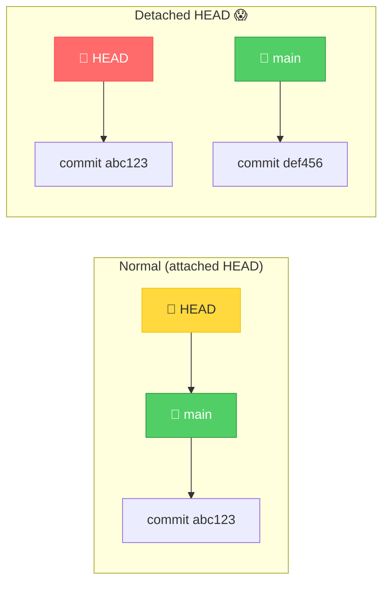
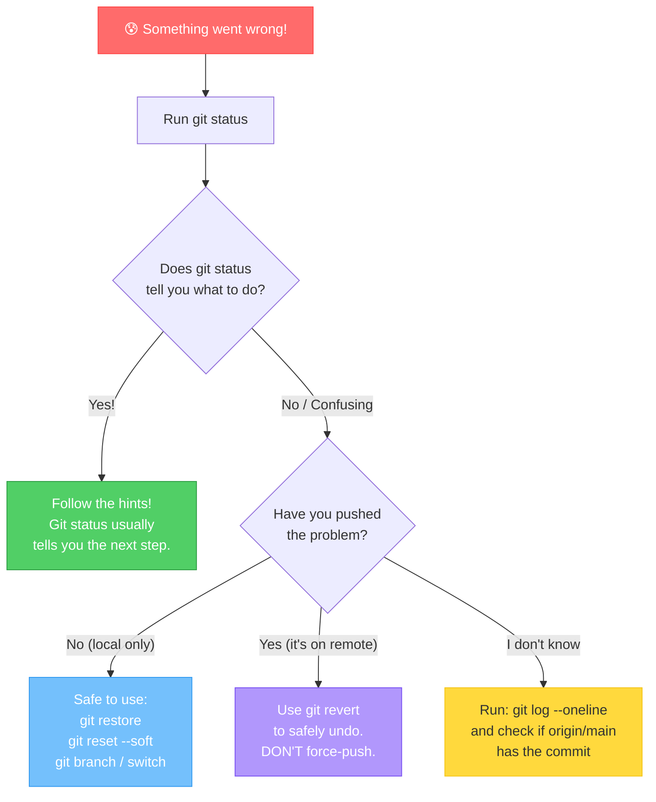

# Appendix: Help, Something Went Wrong! — Troubleshooting

[<< Previous: Best Practices & Cheat Sheet](14_best_practices_and_cheatsheet.md) | [Back to Start >>](00_start_here.md)

---

Things will go wrong. It's not a question of *if*, but *when*. And that's perfectly okay! Every developer has Googled "how to undo X in Git" at 2 AM. This appendix covers the most common "oh no" moments and how to fix them.

Bookmark this page. You'll be back. 😄

---

## 😱 "Detached HEAD State"

### What Happened

You ran something like `git checkout a1b2c3d` (checking out a specific commit by its hash instead of a branch name). Git put you in "detached HEAD" state.

### What It Means

Normally, HEAD points to a **branch** (like `main`), and the branch points to a commit. In detached HEAD, HEAD points **directly at a commit** — no branch involved. It's like stepping off the train to look at the scenery.



### Why It's (Usually) Not Scary

You can look around freely — nothing is broken. But if you make commits in this state, they won't belong to any branch and can get lost.

### How to Fix It

**Option A: Just go back to a branch** (most common)
```bash
git switch main
```

**Option B: You made commits in detached HEAD and want to keep them**
```bash
# Create a new branch right where you are
git switch -c my-rescued-work

# Now your commits are safe on a branch!
```

**Option C: You just want to look at an old commit and go back**
```bash
# You're already looking at it. When done:
git switch main
```

> **💡 How to avoid it:** Use `git switch` instead of `git checkout` for switching branches. `git switch` only works with branches, so you can't accidentally end up in detached HEAD.

---

## 😤 "Your Branch Is Behind / Ahead"

### What Happened

You see messages like:
```
Your branch is behind 'origin/main' by 3 commits, and can be fast-forwarded.
```
or
```
Your branch is ahead of 'origin/main' by 2 commits.
```

### What It Means

- **Behind:** The remote has commits you don't have locally. Your teammates pushed while you weren't looking.
- **Ahead:** You have local commits that haven't been pushed to the remote yet.
- **Both:** You have local commits AND the remote has commits you don't have. This is the most common scenario when collaborating.

### How to Fix It

**Behind — get the latest:**
```bash
git pull
```

**Ahead — push your work:**
```bash
git push
```

**Both behind AND ahead:**
```bash
git pull   # download + merge remote changes
# resolve any conflicts if needed
git push   # then push your merged result
```

---

## 🤦 "I Committed to the Wrong Branch!"

### What Happened

You made a commit on `main` but meant to commit on a feature branch.

### How to Fix It

**If you haven't pushed yet:**

```bash
# Step 1: Create the branch you WANTED to commit on
# (it will include your accidental commit)
git branch feature/oops

# Step 2: Undo the commit on main (move main back one commit)
git reset HEAD~1

# Step 3: Switch to the correct branch
git switch feature/oops
```

Now your commit is on `feature/oops` and `main` is back to where it was. 🎉

**If you already pushed:**

Don't rewrite `main`! Instead:
```bash
# Create the feature branch with the commit
git switch -c feature/oops

# Then revert the commit on main
git switch main
git revert HEAD
git push
```

---

## 😰 "I Need to Undo My Last Commit (But Keep the Changes)"

### What Happened

You committed too soon, or included the wrong files, or the commit message has a typo.

### How to Fix It (Local Only — Not Pushed Yet)

```bash
# Undo the commit, keep changes staged
git reset --soft HEAD~1

# Now you can:
# - Modify the files
# - Change what's staged
# - Re-commit with a better message
git commit -m "Better commit message"
```

| Reset Flag | Commit | Staging Area | Working Directory |
|-----------|--------|-------------|-------------------|
| `--soft` | Undone ✅ | Kept ✅ | Kept ✅ |
| `--mixed` (default) | Undone ✅ | Undone ✅ | Kept ✅ |
| `--hard` | Undone ✅ | Undone ✅ | **Deleted** ⚠️ |

> **⚠️ Watch it!**
>
> **Only use `git reset` on commits that haven't been pushed.** If the commit is already on the remote and your teammates might have it, use `git revert` instead. Rewriting shared history is a recipe for team chaos.

---

## 🔐 "Permission Denied (publickey)"

### What Happened

You tried to push or clone via SSH and got:
```
git@github.com: Permission denied (publickey).
fatal: Could not read from remote repository.
```

### What It Means

Your computer doesn't have SSH keys set up with GitHub, or the keys aren't configured correctly.

### How to Fix It

**Quick fix — switch to HTTPS:**
```bash
git remote set-url origin https://github.com/YOUR-USERNAME/your-repo.git
```

**Proper fix — set up SSH keys:**

1. Check if you have keys:
   ```bash
   ls ~/.ssh/id_ed25519.pub
   ```

2. If not, generate one:
   ```bash
   ssh-keygen -t ed25519 -C "your.email@example.com"
   ```
   Press Enter for defaults.

3. Copy the public key:
   ```bash
   # macOS
   cat ~/.ssh/id_ed25519.pub | pbcopy

   # Linux
   cat ~/.ssh/id_ed25519.pub
   # Then copy the output manually
   ```

4. Go to GitHub → Settings → SSH and GPG keys → New SSH key → paste it

5. Test:
   ```bash
   ssh -T git@github.com
   ```
   You should see: `Hi username! You've successfully authenticated.`

---

## 📁 "I Accidentally Deleted a File!"

### What Happened

You deleted a file that was tracked by Git.

### How to Fix It

**If you haven't committed the deletion:**
```bash
git restore deleted-file.txt
```
Git brings it back from the last commit. Easy!

**If you committed the deletion and want the file back:**
```bash
# Find the last commit that had the file
git log -- deleted-file.txt

# Restore the file from that commit
git checkout <commit-hash> -- deleted-file.txt

# Now stage and commit it back
git add deleted-file.txt
git commit -m "Restore accidentally deleted file"
```

---

## 🌀 "My Merge Is a Mess and I Want to Start Over"

### What Happened

You started a merge, conflicts appeared everywhere, and you want to abort and try again later.

### How to Fix It

```bash
git merge --abort
```

This resets everything to the state before you started the merge. No harm done. Take a breather, talk to your teammate about the conflicting code, and try again when you're ready.

---

## 🔄 "I Want to See What a File Looked Like Before"

### What Happened

You want to peek at an old version of a file without changing your current state.

### How to Do It

```bash
# See the file from a specific commit
git show abc1234:path/to/file.txt

# See the file from 3 commits ago
git show HEAD~3:path/to/file.txt

# See the file from yesterday (cool!)
git show HEAD@{yesterday}:path/to/file.txt
```

These commands just display the content — they don't change anything in your working directory.

---

## 💣 "I Pushed a Secret to GitHub!"

### What Happened

An API key, password, or other secret made it into a commit and was pushed.

### What to Do (In Order!)

1. **Rotate the secret IMMEDIATELY** — change the password, regenerate the API key, revoke the token. This is step one because the secret is already compromised. Bots scan public GitHub repos within seconds.

2. **Remove and ignore the file:**
   ```bash
   echo ".env" >> .gitignore
   git rm --cached .env
   git commit -m "Remove and ignore secrets file"
   git push
   ```

3. **Consider the old secret permanently compromised.** Even if you remove it from Git history, it may have been cached, cloned, or indexed by search engines.

4. **For the future:** Always add `.env` to `.gitignore` before making your first commit.

> **⚠️ Prevention > Cure**
>
> Once a secret is pushed, removing it from Git history is possible but painful (using tools like `git filter-branch` or BFG Repo-Cleaner). It's much easier to never commit secrets in the first place!

---

## 🗺️ The Universal Git Troubleshooting Flowchart

When in doubt, follow this:



The #1 tip: **always read what `git status` says.** It almost always tells you what to do next. Git is friendlier than you think — you just have to read the messages. 😊

---

## One Last Thing 💬

Every developer, no matter how experienced, runs into Git problems. The difference between a beginner and an expert isn't that experts never mess up — it's that experts know how to recover.

You now have the knowledge to recover from almost anything Git throws at you. And for the rare cases where these solutions don't work? There's always:

```bash
# The developer's best friend
# (just kidding... mostly)
```
🌐 Google: "how to undo X in git"

You'd be surprised how many Stack Overflow answers start with "I've been using Git for 10 years and I still had to look this up."

You're in good company. Now go build things! 🚀

---

[<< Previous: Best Practices & Cheat Sheet](14_best_practices_and_cheatsheet.md) | [Back to Start >>](00_start_here.md)
